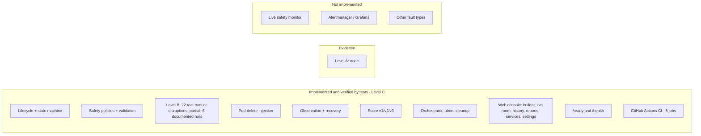

# 01 · Project Overview

| | |
|---|---|
| **Purpose** | State the problem, motivation, goals, scope, current status, non-goals and evolution of AutoResilience, as implemented. |
| **Source of truth** | Repository at commit `92e33dd`; `git log`; root `README.md` (for stated intent only); `CLAUDE.md`. |
| **Last generated from commit** | `92e33dd` |
| **Dependencies on other files** | [25-research-integrity](25-research-integrity.md) (evidence levels), [02-research-context](02-research-context.md) |

---

## 1. Problem

Operators of Kubernetes services need to know how a workload behaves when part of it fails,
for example when a pod is deleted: whether clients notice, for how long, and whether the
workload returns to its normal state. Fault-injection tools such as LitmusChaos can delete
pods. On their own, however, they do not answer three questions:

1. **Is it safe to run this fault here?** For example, does it target a system namespace, or remove too many replicas?
2. **What did the fault actually do to clients and to the cluster?** This needs evidence, not just a pass/fail verdict.
3. **Did the workload recover, and how good was that, in a comparable and explainable number?**

AutoResilience wraps fault injection in a safety-gated, evidence-producing and scored
workflow that a user can drive from a web console (Level C: implemented).

## 2. Motivation

Statements in this section are design rationale (Level D) unless marked otherwise.

| Motivation | Where it shows up in the implementation (Level C) |
|---|---|
| Fault injection without guard-rails can harm system components or remove all serving capacity. | Namespace-scoped safety policies, static and cluster checks, re-validation before injection ([06](06-safety-framework.md)). |
| Server-side metrics and periodic Kubernetes samples can miss short, client-visible outages. | Client load generator with exact counters and outage timing; score v2/v3 ([07](07-evidence-framework.md), [09](09-scoring-methodology.md)). Observed in development (B1, O-03 in [15](15-observation-catalogue.md)). |
| A single opaque number is not actionable. | Per-component breakdown, reasons, versioned methodology ([09](09-scoring-methodology.md)). |
| Uncertain outcomes should not be reported as successes. | Explicit `UNKNOWN` with reason code and cause; platform UNKNOWN is never scored ([08](08-recovery-framework.md)). |
| Long-running experiments must survive API restarts and be abortable. | Persistent, stateless reconciler; abort endpoint; label-verified cleanup ([05](05-system-workflows.md)). |

## 3. Project goals (as realised)

| Goal | Status | Level |
|---|---|---|
| G1 · Self-service configuration of a controlled failure (target workload, fault, blast radius, duration, deletion mode) | Implemented (API + builder UI) | C |
| G2 · Safety validation before anything touches the cluster, re-checked before injection | Implemented | C |
| G3 · Baseline capture of steady-state behaviour | Implemented (Prometheus, 300 s window) | C |
| G4 · Real fault injection | Implemented for **pod-delete only** (LitmusChaos 3.31) | C |
| G5 · Evidence-based impact observation (Kubernetes, server, client, Litmus) | Implemented | C |
| G6 · Explicit recovery decision with an uncertainty outcome | Implemented | C |
| G7 · Explainable, versioned Resilience Score | Implemented (v1, v2, v3; v3 current) | C |
| G8 · Automatic orchestration of the whole lifecycle, restart-safe, abortable | Implemented | C |
| G9 · Evidence-backed reports and history | Implemented in the web console (printable report page; no server-side document export) | C |
| G10 · Alertmanager integration, Grafana, CI reliability gates | **Not implemented** (root `README.md` lists them as scope; the directories are empty) | D |

## 4. Scope

| In scope (implemented) | Boundary |
|---|---|
| Kubernetes Deployments and StatefulSets as targets | Other workload kinds are rejected (`WorkloadKind` enum). |
| Fault type `pod-delete`, modes `GRACEFUL` and `FORCE` | `pod-cpu-hog`, `pod-memory-hog` and `pod-network-latency` exist in the `FaultType` enum but fail validation (`SUPPORTED_FAULT_TYPES`). |
| One fault round per experiment (`CHAOS_INTERVAL = TOTAL_CHAOS_DURATION`) | No repeated or periodic chaos within one experiment. |
| Single cluster, configured by kubeconfig context | Multi-cluster: not implemented. |
| Local evaluation environment: kind cluster `autoresilience` with sample workloads | Production clusters: never used. |
| Web console for configuration, monitoring, history, services and reports | No authentication or multi-user model (Not verified from implementation that any exists; none was found in code). |

## 5. Current status (commit `92e33dd`)

| Area | Status |
|---|---|
| Backend tests | 431 pytest tests (in-memory SQLite plus fakes) |
| Frontend tests | 39 Vitest tests (happy-dom, contract-typed fixtures) |
| CI | `.github/workflows/ci.yml`, 5 jobs; first GitHub run passed: all 5 jobs green (run 37538740103, 2026-10-06T22:09Z, commit `995c66d`) |
| Experimental evidence | No complete records; see [14](14-current-evidence.md) |

## 6. Non-goals

These are not addressed by the implementation and should not be implied in a paper:

- Production deployment, high availability of the AutoResilience API itself. A single API process is assumed (`docs/orchestration.md`).
- Authentication, authorization, multi-tenancy.
- Automatic remediation or self-healing of the target.
- Automatic abort on live signals during a fault (planned: `services/safety/live_monitor.py` is a placeholder).
- Statistical aggregation of scores across runs inside the product. The dashboard shows a mean, min and max of current-version scores, but no confidence intervals.
- AI or LLM components. The scorer is explicitly I/O-free and deterministic.

## 7. Project evolution

Times are commit times in UTC (`TZ=UTC git log`). Each commit packages work done before it.

| Date (UTC) | Commit(s) | Milestone | Research relevance |
|---|---|---|---|
| 2026-08-25 / 08-31 | `f214e3c`, `32fbc38` | Repository scaffolding (placeholders with `# OWNER` / `# Intended` headers) | Shows the intended module boundaries |
| 2026-10-05 20:46–21:28 | `f8bdfcf` … `a6de23d` | Backend foundation: experiment model, state machine, safety policy and cluster-aware validation; kind cluster and sample app; Prometheus baseline; LitmusChaos pod-delete injection | Core lifecycle up to OBSERVING |
| 2026-10-06 09:41 | `ccc2786` | Observation and evidence-based recovery → COMPLETED/UNKNOWN | Recovery rule |
| 09:51 | `c2f7ea9` | Resilience Score **v1** (server and Kubernetes evidence) | Baseline methodology |
| 09:59–10:07 | `b19e548`, `cfa5e23` | Client load generator; Score **v2** (client request failures) | Client-side evidence introduced |
| 10:35 | `4b008b8` | Explicit pod-delete mode GRACEFUL / FORCE | Independent variable |
| 10:55–11:07 | `9b6613e`, `1ddd1a6`, `a0482fa` | Sandbox namespace and policy; fragile single-replica workload with 10 s modelled warm-up | Makes client-visible outages reproducible |
| 11:14–11:28 | `40782d1`, `e1b6923` | Client-observed outage duration metrics; Score **v3** | Current methodology |
| 11:49 | `29d493d` | Automatic orchestration (reconciler), restart recovery, abort, cleanup | One-call lifecycle |
| 12:08–12:56 | `b544e08`, `30628f0`, `1306d68` | Web console F1 (shell, typed API), F2 (builder), F3 (live room) | User workflow |
| 15:19–15:43 | `45e0014`, `730ea81`, `74d064c` | F4 overview, history, reports; DB 503 handling; F5 services/workload discovery | Reporting, targeting |
| 18:49–19:53 | `e1c43d3`, `8f1f3bb`, `745a7b3`, `72be555` | CI; `/ready` readiness; frontend test suite | Engineering quality |
| 20:29 | `92e33dd` | Research evidence audit | Evidence inventory |

The methodology files (scoring, observation, recovery, baseline) and the sample manifests are
**unchanged from `e1b6923` (v3) to `92e33dd`** (verified with `git diff`). Runs after
2026-10-06T11:28Z therefore used the current measurement code.

---

## Related documents
[02-research-context](02-research-context.md) · [03-system-architecture](03-system-architecture.md) · [10-implementation](10-implementation.md) · [14-current-evidence](14-current-evidence.md) · [24-engineering-decisions](24-engineering-decisions.md)

## Missing information
- The original project proposal and the supervisor's requirements are not in the repository (Not verified from implementation).
- The root `README.md` links to `docs/01-project-overview.md` … `docs/06-decisions.md` and `assets/*.svg`, which **do not exist** in the repository.

## Open questions
- Should Alertmanager, Grafana and CI reliability gates be removed from the stated scope, or listed as future work in the paper? Recommended: future work.
- Who are the intended users (SREs, students, platform teams)? This is not stated in the repository.
