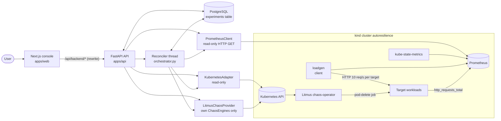
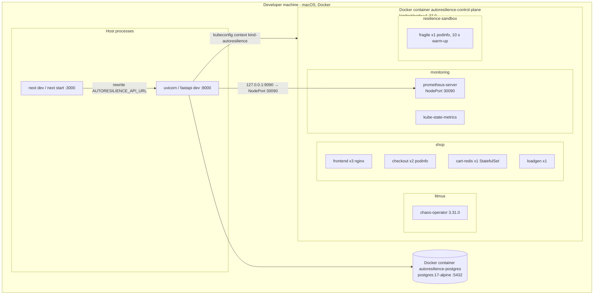
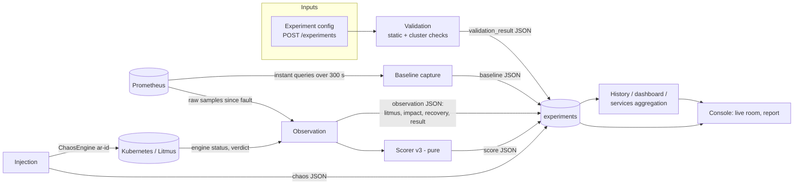
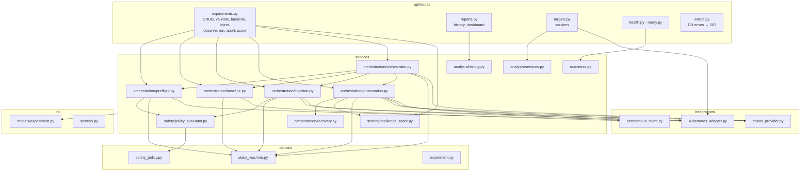
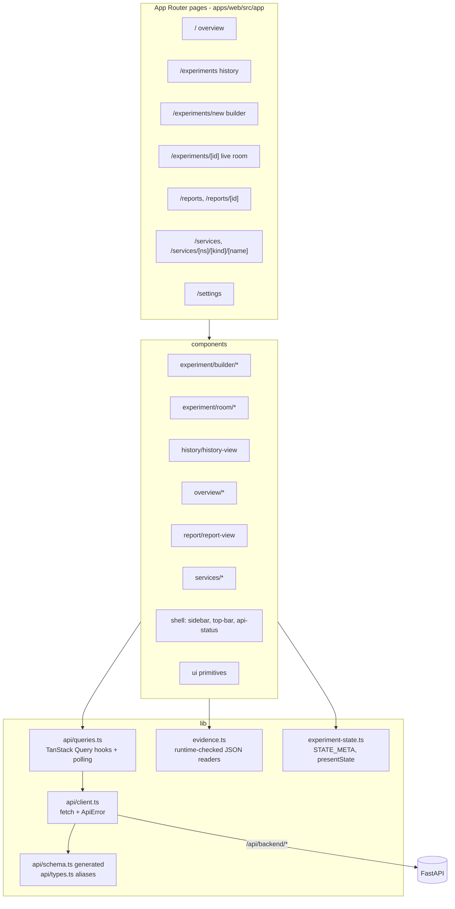
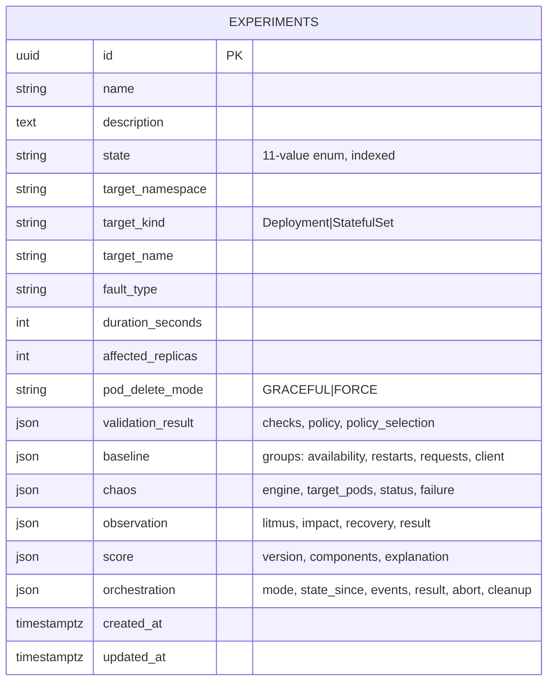
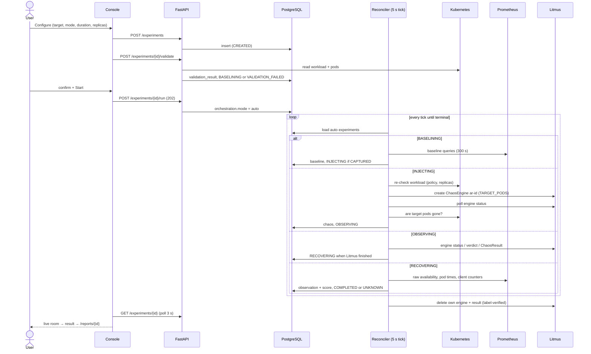
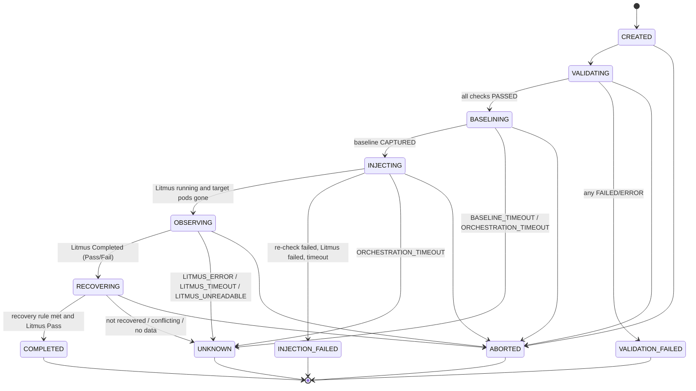

# 03 · System Architecture

| | |
|---|---|
| **Purpose** | Describe the architecture of AutoResilience: high-level structure, deployment, data flow, backend, frontend, persistence, sequences and states. |
| **Source of truth** | `apps/api/app/**`, `apps/web/src/**`, `infra/**`, `chaos/**`, `monitoring/prometheus/values.yaml`, `scripts/*.sh` at `92e33dd`. |
| **Last generated from commit** | `92e33dd` |
| **Dependencies on other files** | [04-component-design](04-component-design.md) (per-component detail), [05-system-workflows](05-system-workflows.md) (full sequences), [12-experimental-environment](12-experimental-environment.md) (concrete environment) |

All statements are Level C (implementation) unless marked otherwise.

---

## 1. High-level architecture

**Key architectural properties (Level C):**

| Property | Where enforced |
|---|---|
| A single writer to the cluster, restricted to its own objects | `LitmusChaosProvider` creates, stops and deletes only `ar-<experiment id>` ChaosEngines and their ChaosResult |
| Read-only Kubernetes and Prometheus access | `KubernetesAdapter` uses only `read_*`/`list_*` calls (asserted in `tests/unit/test_kubernetes_adapter.py`); `PrometheusClient` only issues GET `/api/v1/query` |
| Persistent, stateless orchestration | All progress lives in `experiments` JSON columns; the reconciler re-reads state on every tick |
| Pure decision logic | `policy_evaluator.py`, `recovery.py` (`find_recovery`), `resilience_score.py` have no I/O |
| A typed contract between backend and frontend | `packages/contracts/openapi.json` → `apps/web/src/lib/api/schema.ts` (`scripts/gen-api-contracts.sh`); drift is checked in CI |

## 2. Deployment architecture

- The API and the console run **outside** the cluster as host processes.
- The API reaches the cluster through the kubeconfig context `KUBE_CONTEXT` (default: the current context), and Prometheus via the kind port mapping `127.0.0.1:9090 → 30090` (`infra/kind/cluster.yaml`).
- There is no in-cluster deployment of AutoResilience: `infra/helm` is empty, so Helm deployment of AutoResilience is not implemented.

## 3. Data flow

## 4. Backend architecture

**Layering rules visible in the code:**
- `domain/` has no I/O.
- `integrations/` wrap external systems and translate their errors: `ClusterUnavailableError`, `PrometheusError`, `ChaosProviderError`.
- `services/` hold lifecycle logic and accept integrations through `typing.Protocol` interfaces (`Cluster`, `Chaos`, `Metrics`, `ValueQuery`), which is why tests can inject fakes.
- Routes obtain integrations through FastAPI dependencies (`get_kubernetes_adapter`, `get_prometheus_client`, `get_chaos_provider`, `get_now`, …).

## 5. Frontend architecture

- **Data access:** all through TanStack Query hooks with polling:
  - one experiment: 3 s while non-terminal;
  - lists: 3 s while a run is active, otherwise 15 s;
  - dashboard: 5 s or 15 s;
  - services: 15 s;
  - readiness: 15 s when ready, 5 s otherwise.
- **Evidence JSON** (free-form backend dictionaries) is read only through `lib/evidence.ts`. A missing field becomes `null` and is shown as "No data", never invented.
- **No server-side rendering of data:** pages are client components fetching the API.

## 6. Persistence architecture

One table, `experiments` (`apps/api/app/db/models/experiment.py`). Typed columns hold the
configuration; JSON columns hold the evidence of each lifecycle phase.

Migration chain (Alembic, `apps/api/alembic/versions/`):
`d212b6a34d8b` create table → `90b79844b9cf` target, fault and validation → `d369e0debbe0` baseline → `98573305f15d` chaos → `d43ecd782a89` observation → `0363e45a3d5b` score → `000336cc0672` pod_delete_mode → `08697f19aec0` orchestration (head).

The JSON shapes are specified in [appendix/experiment-json-schema](appendix/experiment-json-schema.md).

## 7. End-to-end sequence (automatic run)

## 8. Experiment state diagram

The state machine (`domain/state_machine.py`) also defines `UNKNOWN → ABORTED`, but
`orchestrator.py` treats UNKNOWN as terminal and `ABORTABLE` excludes it. The edge is
therefore **unreachable through the API** ([08](08-recovery-framework.md) §5).

## 9. Component summary

| Component | Purpose | Responsibilities | Inputs | Outputs | Dependencies | Failure modes (and handling) |
|---|---|---|---|---|---|---|
| Web console | Self-service UI | Configure, validate, run, follow, abort, browse history, services and reports | User input; API JSON | HTTP requests | API via rewrite | API unreachable → "API unreachable"; DB down → 503 message; readiness indicator ([04](04-component-design.md) §1) |
| Experiment API | System boundary | Validation of input (Pydantic), lifecycle endpoints, history and services, readiness | HTTP JSON | Experiment JSON | DB, integrations | 422 invalid input; 404 unknown id; 409 wrong state or auto-driven; 503 DB or cluster unavailable |
| Reconciler | Automatic lifecycle | One bounded step per tick per auto experiment; deadlines; cleanup | DB state, clock | State transitions, evidence | All integrations | Step exception → `orchestration.last_error`, retried next tick; deadlines → UNKNOWN/ABORTED |
| Safety evaluator | Gatekeeping | Static and cluster checks | Spec, policy, workload status | Check list | Policy, adapter | Cluster error → ERROR (never PASSED) |
| Kubernetes adapter | Cluster facts | Workload status, ready pods, live pods, workload list | kubeconfig context | `WorkloadStatus` | Kubernetes API | `ClusterUnavailableError`; 404 → `None` |
| Prometheus client | Metrics | Instant and range-vector queries | PromQL | Samples, series | Prometheus HTTP | `PrometheusError` on any failure |
| Chaos provider | Fault injection | Create, poll, stop and delete own engines | `PodDeleteRequest` | Engine name, status, result | Kubernetes custom objects | `ChaosProviderError`, `ChaosEngineExistsError`; system namespaces refused |
| Recovery analyzer | Recovery decision | `find_recovery`, client counts, outage pattern | Raw samples, pod times | `RecoveryFinding`, impact | None (pure) | Insufficient data → reported, not guessed |
| Scorer | Explainable score | v1/v2/v3 computation | State, baseline, observation, chaos | Score dict | None (pure) | NOT_SCORED with reason |
| Database | System of record | Persist experiments and evidence | ORM | Rows | PostgreSQL | Unreachable → 503 + `/ready` not_ready |
| Readiness | Operability | DB reachable and at the migration head | DB | `ready` / `not_ready` | DB, Alembic scripts | 503 with a reason code |

---

## Related documents
[04-component-design](04-component-design.md) · [05-system-workflows](05-system-workflows.md) · [10-implementation](10-implementation.md) · [12-experimental-environment](12-experimental-environment.md) · [appendix/repository-map](appendix/repository-map.md)

## Missing information
- No architecture diagram assets exist in the repository (`assets/` referenced by `README.md` is absent).
- In-cluster deployment of AutoResilience: not implemented.

## Open questions
- For the paper, should the deployment view show the evaluation setup (host processes plus kind) or an idealised in-cluster deployment? Recommended: the actual evaluation setup only.
