# 05 · System Workflows

| | |
|---|---|
| **Purpose** | Complete, step-level workflows with sequence diagrams: creation, validation, baseline, injection, observation, recovery, scoring, reporting, abort, cleanup, restart recovery, history, and manual mode. |
| **Source of truth** | `api/routes/experiments.py`, `services/orchestration/*.py`, `apps/web/src/components/**` at `92e33dd`. |
| **Last generated from commit** | `92e33dd` |
| **Dependencies on other files** | [03-system-architecture](03-system-architecture.md), [04-component-design](04-component-design.md), [08-recovery-framework](08-recovery-framework.md) |

All workflows are Level C. Timeouts are configuration defaults from `core/config.py`.

---

## 1. Experiment creation (console: Configure)

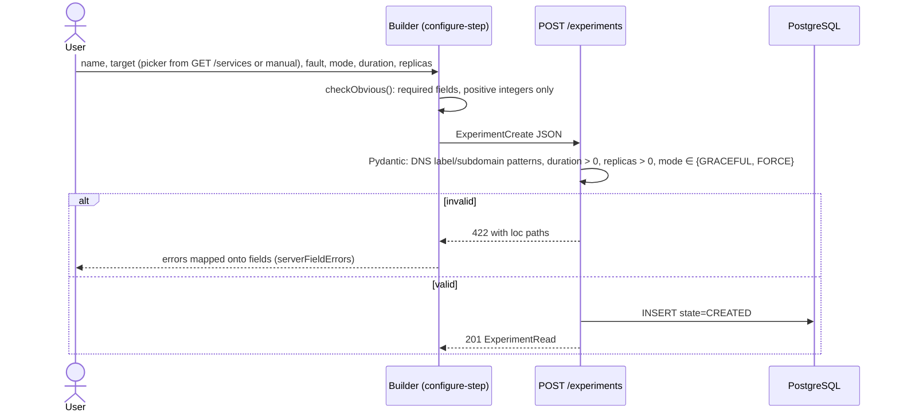

The builder remembers the payload it created from. Changing the configuration after a
check creates a new experiment on the next check; the earlier one stays in history.

## 2. Validation (console: Safety check)

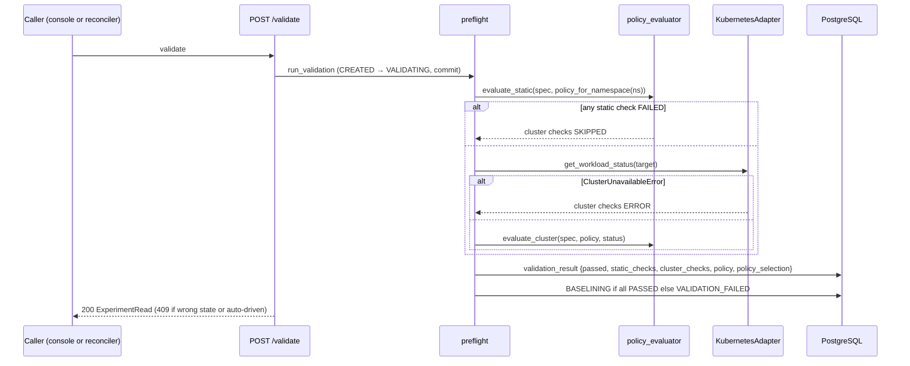

The console shows exactly what the server returned. A blocked experiment stays in history
as VALIDATION_FAILED.

## 3. Start (console: Review & start)

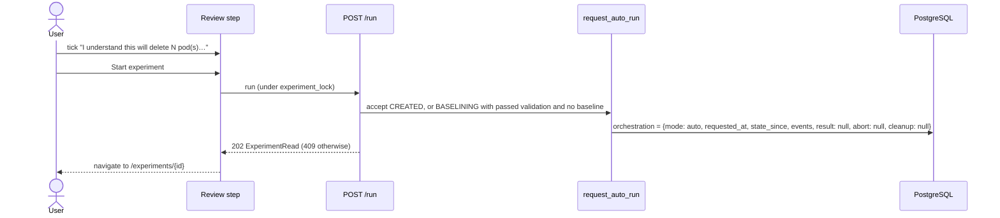

## 4. Baseline

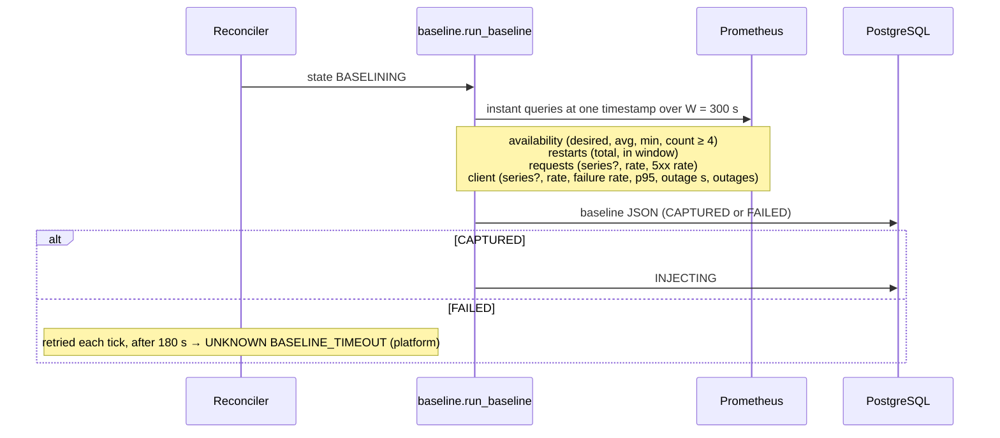

## 5. Injection

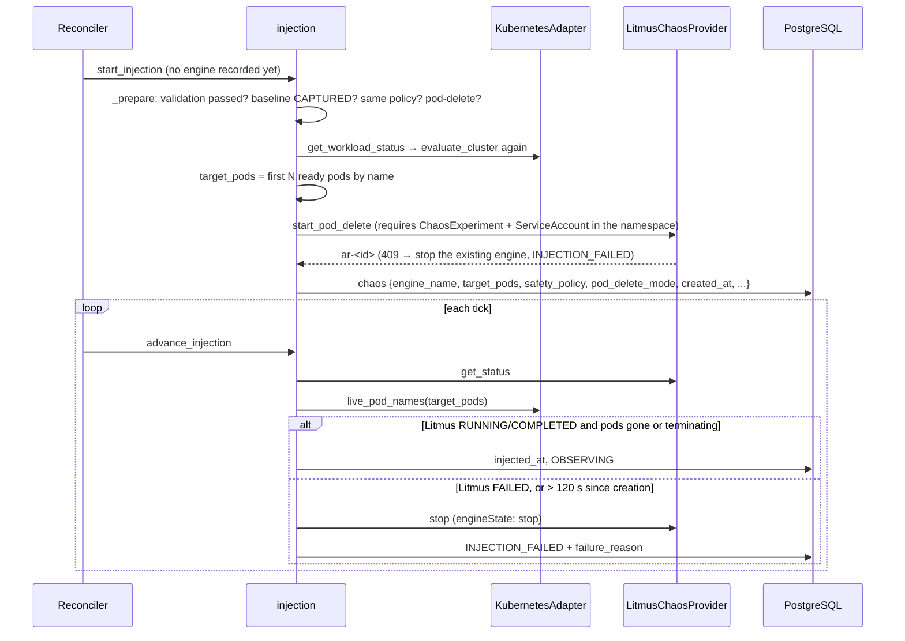

## 6. Observation (Litmus phase)

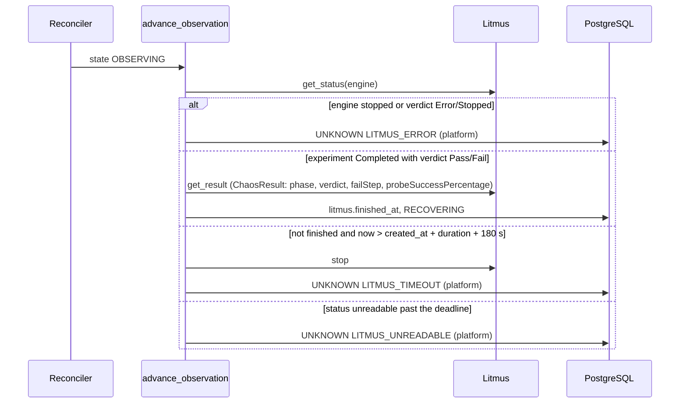

## 7. Recovery evaluation

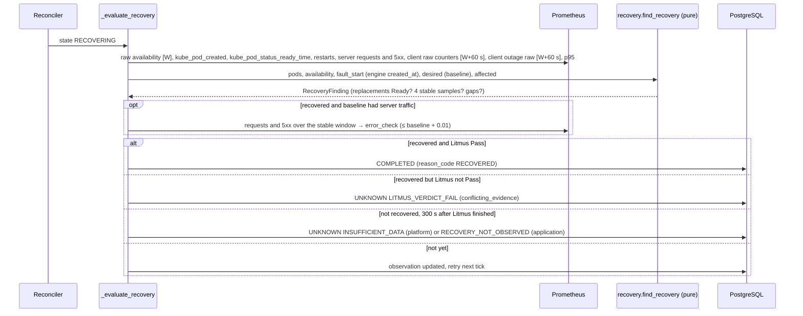

## 8. Scoring

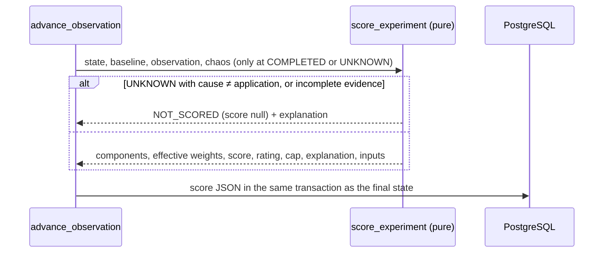

## 9. Reporting (console)

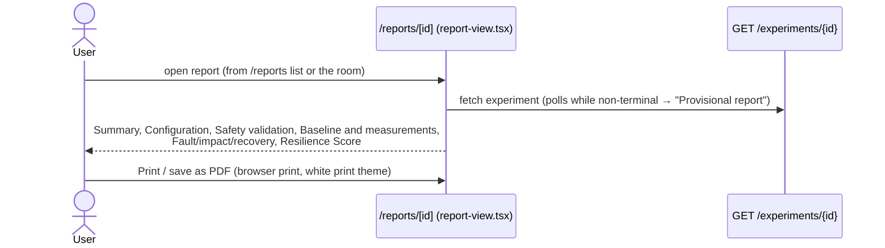

No server-side report artefact is produced ([04](04-component-design.md) §14).

## 10. Abort

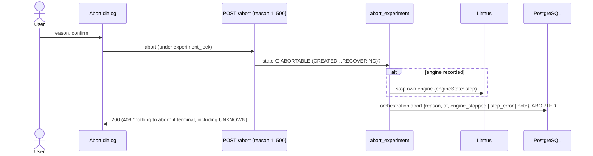

Pods that were already deleted are not restored; Kubernetes replaces them as usual (shown in
the dialog text).

## 11. Cleanup

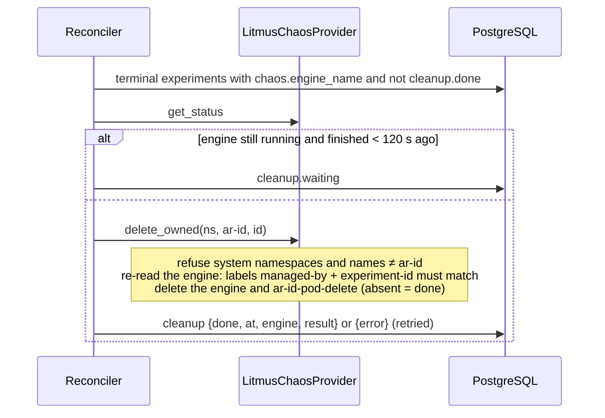

ChaosEngines unknown to the database are never touched. This is why six engines from deleted
development databases remain in `resilience-sandbox` ([14](14-current-evidence.md)).

## 12. Restart recovery

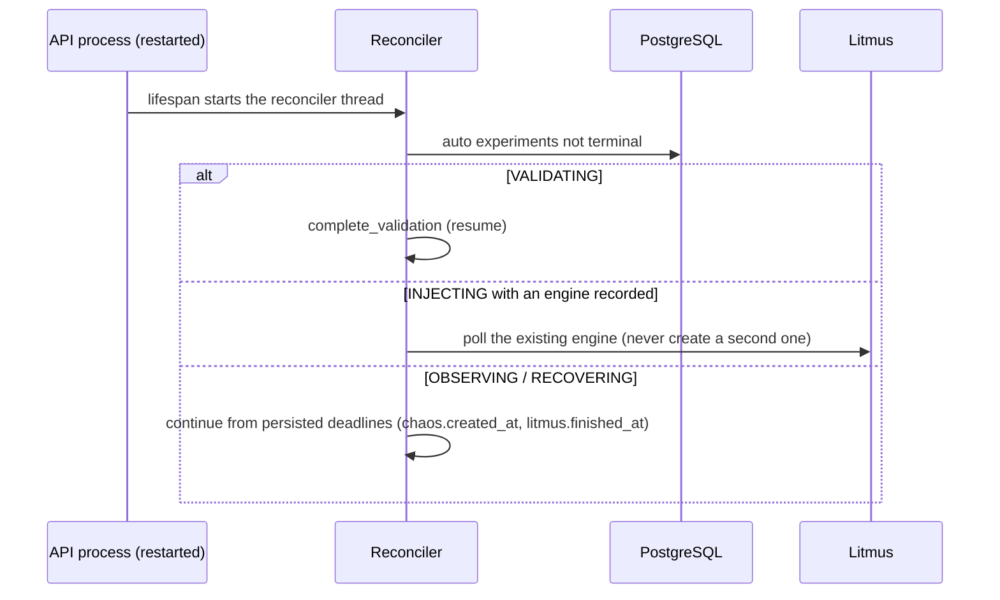

Documented verification (B2, `docs/orchestration.md`): an API killed in OBSERVING and
restarted 26 s later resumed to COMPLETED with a single engine.

## 13. History and services

| Workflow | Endpoint | Behaviour |
|---|---|---|
| History list | `GET /experiments/history?q&state&fault_type&namespace&sort&order&limit&offset` | SQL filtering, sorting and paging; slim rows (`ExperimentSummary`); the console keeps the filters in the URL. |
| Dashboard | `GET /dashboard/summary` | Counts by state and outcome group, current-version score statistics, recovery and outage distributions, score history, namespaces, recent runs. |
| Services | `GET /services`, `GET /services/{ns}/{kind}/{name}` | Live workloads outside system namespaces joined with exact-target history; the detail view adds live pod status, tested faults and score history. |

## 14. Manual (step-by-step) mode

The manual endpoints exist for operators and tests. They are not used by the console's
start flow, which uses `/run`.

| Step | Endpoint | Note |
|---|---|---|
| Validate | `POST /experiments/{id}/validate` | Also used by the console before `/run`. |
| Baseline | `POST /experiments/{id}/baseline` | |
| Inject | `POST /experiments/{id}/inject` | Blocks up to ~15 s on kind (`run_injection` polling). |
| Observe | `POST /experiments/{id}/observe` | One bounded step per call; the client polls. |

All manual endpoints return 409 for auto-driven experiments (`_manual_only`).

---

## Related documents
[03-system-architecture](03-system-architecture.md) · [06-safety-framework](06-safety-framework.md) · [07-evidence-framework](07-evidence-framework.md) · [08-recovery-framework](08-recovery-framework.md) · [09-scoring-methodology](09-scoring-methodology.md)

## Missing information
- End-to-end timing distributions per phase (how long validation, baseline and observation take) have not been measured systematically. The only figure is B2: "COMPLETED in 101 s" for one automatic sandbox run.

## Open questions
- Should the paper present the manual mode at all? Recommended: one sentence; the evaluation should use `/run` only.
