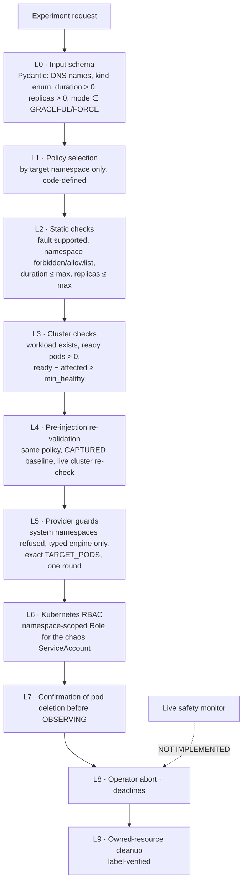

# 06 · Safety Framework

| | |
|---|---|
| **Purpose** | Everything about safety: static and runtime safety, namespace policies, sandbox, blast radius, live safety, abort and cleanup, with current versus future implementation. |
| **Source of truth** | `domain/safety_policy.py`, `services/safety/policy_evaluator.py`, `services/orchestration/preflight.py`, `services/orchestration/injection.py`, `integrations/chaos_provider.py`, `integrations/kubernetes_adapter.py`, `services/orchestration/orchestrator.py`, `chaos/rbac/pod-delete-rbac.yaml`, `scripts/dev-cluster.sh`, `chaos/policies/safety-policy.md` at `92e33dd`. |
| **Last generated from commit** | `92e33dd` |
| **Dependencies on other files** | [04-component-design](04-component-design.md) §3, §6; [05-system-workflows](05-system-workflows.md) §2, §5, §10, §11 |

All statements are Level C unless marked otherwise.

---

## 1. Safety model overview

Safety is layered. No single layer is trusted alone.

## 2. Namespace policies

`domain/safety_policy.py`:

| Field | `default` | `sandbox` |
|---|---|---|
| Applies to | every namespace without a specific mapping | `resilience-sandbox` (`POLICIES_BY_NAMESPACE`) |
| `max_duration_seconds` | 300 | 300 |
| `max_affected_replicas` | 1 | 1 |
| `min_healthy_replicas` (ready − affected must be ≥) | **1** | **0** |
| `forbidden_namespaces` | `SYSTEM_NAMESPACES` = {kube-system, kube-public, kube-node-lease, local-path-storage, litmus, monitoring} | same |
| `allowed_namespaces` | None (any non-forbidden) | {resilience-sandbox} |

**Selection rule.** `policy_for_namespace(namespace)` looks up a fixed dictionary. No API
field selects, creates or edits a policy; unknown request fields are ignored by Pydantic.
Every validation result stores the full policy (`policy.to_dict()`) and a
`policy_selection` audit record (namespace, policy name, rule text).

**Sandbox rationale.** The sandbox permits removing the only replica
(`min_healthy_replicas = 0`), which makes client-visible outages reproducible on the
single-replica `fragile` workload. Its allowlist means the sandbox policy cannot validate any
other namespace, even if it were selected by mistake. The namespace carries the label
`autoresilience.io/sandbox=true` (`infra/sample-app/sandbox.yaml`). The policy is selected by
namespace name, not by that label.

## 3. Static safety (L2)

`evaluate_static` runs every check without short-circuiting:

| Check | Pass condition | Example failure message |
|---|---|---|
| `fault_type_supported` | `fault_type ∈ SUPPORTED_FAULT_TYPES = {pod-delete}` | Fault type 'pod-cpu-hog' is not supported yet |
| `namespace_not_forbidden` | namespace ∉ `forbidden_namespaces` | Namespace 'kube-system' is protected and cannot be targeted |
| `namespace_allowed` | no allowlist, or namespace ∈ allowlist | Namespace 'shop' is not in the allowlist ['resilience-sandbox'] |
| `duration_within_limit` | duration ≤ `max_duration_seconds` | Duration 600s > limit 300s |
| `affected_replicas_within_limit` | affected ≤ `max_affected_replicas` | Affected replicas 3 > limit 1 |

## 4. Cluster safety (L3)

Queried **only if every static check passes**. Kubernetes errors become `ERROR`, never a pass.

| Check | Pass condition | Notes |
|---|---|---|
| `target_workload_exists` | the Deployment/StatefulSet exists | 404 → FAILED; the others are SKIPPED |
| `target_has_running_pods` | ready pods > 0 | Ready = phase Running, not terminating, condition Ready=True |
| `min_healthy_replicas_after_fault` | ready − affected ≥ `min_healthy_replicas` | SKIPPED if no ready pods |

Every check has a status `PASSED | FAILED | ERROR | SKIPPED`. Only all-PASSED moves the
experiment to BASELINING.

**Consequence (inference from the policy values):** under `default`, any single-replica workload (e.g. `shop/cart-redis`) is blocked by
`min_healthy_replicas_after_fault` (1 ready − 1 affected = 0 < 1).

## 5. Runtime safety at injection (L4–L7)

| Guard | Implementation | Outcome on failure |
|---|---|---|
| Validation must have passed | `_prepare` | INJECTION_FAILED |
| Baseline must be CAPTURED | `_prepare` | INJECTION_FAILED |
| Policy unchanged since validation | `_prepare` compares `validation_result.policy.name` with the policy re-resolved now | INJECTION_FAILED "Safety policy changed since validation" |
| Live cluster re-check | `evaluate_cluster` on the current `WorkloadStatus` | INJECTION_FAILED "Pre-injection cluster check failed" |
| Deterministic targets | the first `affected_replicas` **ready** pods by name | — |
| System namespaces refused by the provider | `build_pod_delete_engine`, `delete_owned` | `ChaosProviderError` → INJECTION_FAILED |
| No user-supplied YAML | engine built from typed fields; only `FORCE` true/false is mode-dependent | — |
| Exactly one deletion round | `CHAOS_INTERVAL = TOTAL_CHAOS_DURATION = duration` | — |
| Never two engines per experiment | deterministic name `ar-<id>`; on 409 the existing engine is stopped and the run failed | INJECTION_FAILED |
| Prerequisites present | the namespace must hold ChaosExperiment `pod-delete` and ServiceAccount `autoresilience-chaos` | INJECTION_FAILED |
| Deletion confirmed before OBSERVING | Litmus RUNNING/COMPLETED **and** target pods gone or terminating | timeout 120 s → engine stopped, INJECTION_FAILED |

## 6. Blast radius

| Dimension | Bound | Enforced by |
|---|---|---|
| Namespaces | non-system; allowlist under sandbox | policy + provider |
| Pods per experiment | ≤ `max_affected_replicas` (1 for both policies) | static check; `TARGET_PODS` lists exactly those pods |
| Remaining capacity | ready − affected ≥ 1 (default) or ≥ 0 (sandbox) | cluster check at validation **and** injection |
| Duration | ≤ 300 s | static check |
| Deletion rounds | 1 | `CHAOS_INTERVAL = TOTAL_CHAOS_DURATION` |
| Deletion mode | GRACEFUL (pod grace period, SIGTERM first) or FORCE (`gracePeriodSeconds=0`) | `FORCE` env of litmus-go 3.31 `pod-delete` (per `chaos/policies/safety-policy.md`) |
| Kubernetes permissions of the chaos job | namespace-scoped Role (below) | Kubernetes RBAC |

**RBAC of `autoresilience-chaos`** (`chaos/rbac/pod-delete-rbac.yaml`, applied per chaos
namespace by `scripts/dev-cluster.sh` with the namespace rewritten by `sed`). It is a
namespace-scoped `Role`, not a ClusterRole:

| API group | Resources | Verbs |
|---|---|---|
| core | pods | get, list, watch, delete, deletecollection |
| core | pods/log, replicationcontrollers | get, list |
| core | events | create, get, list, patch, update |
| apps | deployments, statefulsets, replicasets, daemonsets | get, list |
| batch | jobs | create, get, list, delete, deletecollection |
| litmuschaos.io | chaosengines, chaosexperiments, chaosresults | create, get, list, patch, update, delete |

`chaos/policies/safety-policy.md` summarises this as "only allows deleting pods in its own
namespace". More precisely, the Role also allows Job and Litmus custom-resource management in
that namespace. It has no cluster-wide rights.

**AutoResilience API permissions.** The API uses the developer's kubeconfig context; it has
no dedicated service account. Its read-only behaviour is therefore guaranteed by **code**
(only `read_*`/`list_*` in the adapter, asserted by tests; only own-engine operations in the
provider), **not by RBAC**. This is listed as a threat in [20](20-threats-to-validity.md).

## 7. Live safety

| | |
|---|---|
| **Current implementation** | None. During OBSERVING and RECOVERING, no automatic safety signal stops a run. Bounds are deadlines only (Litmus grace 180 s, recovery 300 s, whole run 1,800 s) plus an operator abort. |
| **Future implementation** | `services/safety/live_monitor.py` placeholder: "mid-experiment abort watcher; polls pod state during INJECTING/OBSERVING" (Level D). |

## 8. Abort

| Aspect | Implementation |
|---|---|
| Allowed states | `ABORTABLE` = CREATED, VALIDATING, BASELINING, INJECTING, OBSERVING, RECOVERING |
| Action | Stop **this experiment's own** engine (`engineState: stop`) if one exists; record `orchestration.abort` {reason, at, engine_stopped or stop_error, note}; → ABORTED |
| Input | reason, 1–500 characters (`AbortRequest`) |
| Not done | Deleted pods are not restored (Kubernetes replaces them); no rollback. |
| Interface | `POST /experiments/{id}/abort`; console dialog in the live room |

## 9. Cleanup ownership (L9)

`delete_owned` deletes only when the namespace is not a system namespace, the name equals
`ar-<experiment id>`, and the re-read engine carries both `app.kubernetes.io/managed-by=autoresilience`
and `autoresilience.io/experiment-id=<id>`. Engines unknown to the database are never
touched. B1 evidence: six such engines from deleted development databases remain untouched in
`resilience-sandbox` ([14](14-current-evidence.md)).

## 10. Safety verification status

| Property | Level C (tests) | Level B (observed) | Level A |
|---|---|---|---|
| Forbidden namespace blocked | `tests/unit/test_safety_policy.py` (parametrised over `SYSTEM_NAMESPACES`), `test_validation.py` | none retained: blocks were exercised during development, but no record or committed document preserves them | S1 pending |
| Sandbox policy confined to its namespace | `tests/unit/test_safety_policy.py::test_sandbox_policy_cannot_validate_any_other_namespace`, `tests/api/test_sandbox_policy.py::test_policy_cannot_be_chosen_by_request_fields` | — | S1 pending |
| Policy change between validation and injection refused | `tests/api/test_sandbox_policy.py::test_injection_refuses_if_policy_changed_since_validation`; cluster change: `tests/api/test_injection.py::test_cluster_changed_since_validation_blocks_injection` | — | — |
| Adapter read-only | `tests/unit/test_kubernetes_adapter.py` (`assert_read_only`) | — | — |
| Only own engines cleaned up | `tests/api/test_orchestration.py`, `tests/unit/test_chaos_provider.py` | six foreign engines untouched (B1) | R1 pending |
| Exactly the target pods deleted | engine built from `TARGET_PODS` | the six surviving engines each list exactly one pod (B1) | E1–E3 audit pending |

---

## Related documents
[04-component-design](04-component-design.md) · [05-system-workflows](05-system-workflows.md) · [16-final-experiment-matrix](16-final-experiment-matrix.md) (S1) · [20-threats-to-validity](20-threats-to-validity.md) · [24-engineering-decisions](24-engineering-decisions.md)

## Missing information
- No live safety monitor.
- No dedicated, least-privilege identity for the API.
- No Level A safety evaluation (S1).
- The exact Litmus `FORCE` semantics are documented from litmus-go 3.31 behaviour in `chaos/policies/safety-policy.md`; the go-runner source is not in this repository (Not verified from implementation).

## Open questions
- Is `max_affected_replicas = 1` too restrictive for evaluating multi-pod faults? Changing it changes the safety claim.
- Should the paper treat RBAC as a safety layer, given that the API itself runs with admin kubeconfig rights?
