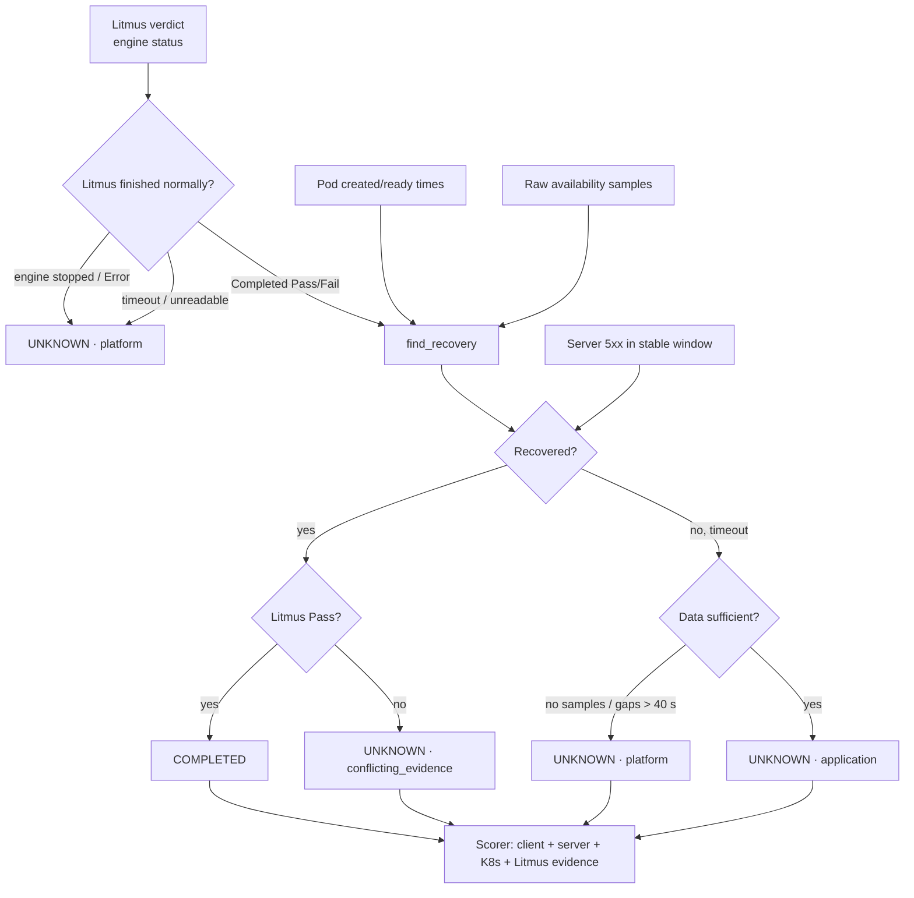

# 07 · Evidence Framework

| | |
|---|---|
| **Purpose** | Describe every evidence source, what it measures, at which resolution, when it is collected, how sources are merged into one experiment record, and the evidence philosophy implemented in the code. |
| **Source of truth** | `services/orchestration/baseline.py`, `recovery.py`, `observation.py`, `integrations/*`, `infra/sample-app/loadgen/loadgen.py`, `monitoring/prometheus/queries.md`, `monitoring/prometheus/values.yaml` at `92e33dd`. |
| **Last generated from commit** | `92e33dd` |
| **Dependencies on other files** | [08-recovery-framework](08-recovery-framework.md), [09-scoring-methodology](09-scoring-methodology.md), [appendix/experiment-json-schema](appendix/experiment-json-schema.md) |

All statements are Level C unless marked otherwise.

---

## 1. Evidence sources

| Source | What it observes | How AutoResilience reads it | Resolution | Present for |
|---|---|---|---|---|
| **Kubernetes API** (live) | Workload spec and status, pod phase and readiness, pod existence | `KubernetesAdapter` at validation, at injection (re-check and deletion confirmation), and after recovery (`target` evidence) | Instantaneous reads | All Deployment/StatefulSet targets |
| **kube-state-metrics via Prometheus** | Desired, available and ready replicas; container restarts; pod created and ready timestamps | `PrometheusClient` (instant and range-vector queries) | Availability: 15 s scrape samples. Pod timestamps: **1 s** (Kubernetes object timestamps, independent of scrapes). | All targets |
| **Application (server) metrics via Prometheus** | `http_requests_total{status}` | Baseline `requests` group; observation `requests_in_window`, `errors_in_window`; recovery criterion 3 | 15 s scrapes; `increase()` | Only pods that expose it with `prometheus.io/scrape` (`shop/checkout`, `resilience-sandbox/fragile`, both podinfo). Others: `UNAVAILABLE`. |
| **Client load generator via Prometheus** | Per-outcome request counters, latency histogram, outage seconds, outage transitions, last outage start and end | Baseline `client` group; observation `impact.client` from **raw counter samples** | Counts exact; outage boundaries at request granularity (0.1 s interval, up to the 1 s timeout during timeouts); scrape 15 s for timing of failure intervals | `shop/checkout`, `shop/frontend`, `resilience-sandbox/fragile` |
| **LitmusChaos** | Engine status, experiment status, verdict, ChaosResult (phase, verdict, failStep, probeSuccessPercentage) | `LitmusChaosProvider.get_status` and `get_result` | Polled each tick (5 s) or per injection poll | Every injected experiment |
| **AutoResilience database** | The experiment record itself: configuration, all evidence, orchestration timeline (`state_since`, ≤ 50 events) | SQLAlchemy | Commit timestamps | All experiments |

## 2. Evidence by lifecycle phase

```mermaid
flowchart LR
    subgraph V[Validation]
        V1[K8s live: workload, ready pods]
    end
    subgraph B[Baseline · 300 s window]
        B1[availability: desired, avg, min, samples]
        B2[restarts]
        B3[server requests: rate, 5xx]
        B4[client: rate, failure ratio, p95, outage s, outages]
    end
    subgraph I[Injection]
        I1[K8s live: re-check, target pods gone]
        I2[Litmus: phase, status]
    end
    subgraph O[Observation · W = now − engine created]
        O1[Litmus: verdict, ChaosResult]
        O2[raw availability samples]
        O3[pod created / ready times]
        O4[restarts, server requests, 5xx]
        O5[client raw counters, outage raw, p95]
    end
    subgraph R[Recovery]
        R1[find_recovery: replacements + stable streak]
        R2[stable-window 5xx check]
        R3[K8s live: target evidence]
    end
    V --> B --> I --> O --> R
```

| Phase | Stored in | Key fields |
|---|---|---|
| Validation | `validation_result` | `passed`, `static_checks[]`, `cluster_checks[]` ({name, status, message}), `policy`, `policy_selection` |
| Baseline | `baseline` | `status`, `captured_at`, `window_seconds`, groups `availability`, `restarts`, `requests`, `client` ({status, message, values}), `failure_reasons` |
| Injection | `chaos` | `engine_name`, `namespace`, `target_pods`, `pod_delete_mode`, `safety_policy`, `duration_seconds`, `created_at` (fault start), `injected_at`, `status`, `failure_reason`, `stopped`, `stop_error` |
| Observation and recovery | `observation` | `rule`, `evaluations`, `updated_at`, `litmus`, `impact`, `recovery`, `target`, `result` {status, reason_code, reason, cause}, `last_error` |
| Score | `score` | see [09](09-scoring-methodology.md) |
| Orchestration | `orchestration` | `mode`, `requested_at`, `state_since`, `events`, `result`, `abort`, `cleanup`, `last_error`, `last_tick_at` |

Full shapes: [appendix/experiment-json-schema](appendix/experiment-json-schema.md).

## 3. Observation window

- **Fault start** = `chaos.created_at`, the ChaosEngine creation time recorded by AutoResilience.
- **Window** `W = int(now − fault_start) + 1` seconds, re-evaluated on every observation step, so the window grows until the final decision.
- **Client counters** are read with an extra 60 s lookback (`CLIENT_LOOKBACK_SECONDS`), so the **last scrape before the fault** is the counting start (`starts_before_fault` flags when it is not).

Note (inference, B1 support): Litmus deletes the pod about 14 s after engine creation on this
cluster. The surviving engines show engine creation → replacement pod creation of 13–14 s.
That pre-deletion interval is inside `W` but contains no impact.

## 4. Client measurement (the load generator instrument)

| Property | Implementation |
|---|---|
| Request pattern | One sequential worker per target; one request every 0.1 s; **new TCP connection per request** (each request is load-balanced independently by the Service) |
| Timeout | 1 s (connect or response) |
| Outcome classes | `success` (< 500), `http_error` (≥ 500), `timeout`, `connection_error` (refused, reset, DNS, closed without response) |
| Outage definition | Starts at the start of the first failing request after a success; ends at the start of the next successful request |
| Outage accrual | Added after every failing request (`accounted_until`), so scrape gaps never lose down time |
| Exported | counters (requests by outcome, outage seconds, outages), gauges (last outage start and end, Unix time), latency histogram |

**Derived per experiment** (`recovery.client_window_counts`, `recovery.client_outage`):
- Exact counter increases between raw samples (`_counter_increase`): no `rate()` or `increase()` extrapolation, and counter resets are handled.
- `failure_ratio` = failed / requests; `failure_intervals` = scrape intervals containing failures.
- Outage `pattern`:

  | Pattern | When |
  |---|---|
  | `NONE` | 0 s and 0 transitions |
  | `CONTINUOUS` | ≤ 1 transition |
  | `INTERMITTENT` | > 1 transition |
  | `INSUFFICIENT_DATA` | series missing, counting started after the fault, or a counter reset |

  Outage windows come from the gauges.

**Cross-validation (B1).** In 15 retained fragile episodes, outage seconds computed from the
gauges equal the counter increase exactly, and failure counts for the documented runs match the
committed docs ([15](15-observation-catalogue.md) O-02).

## 5. How evidence is merged into a decision

| Decision | Evidence used | Evidence **not** used |
|---|---|---|
| Recovery (COMPLETED vs UNKNOWN) | pod timestamps, raw availability, server 5xx (if a baseline exists), Litmus verdict | client counters (by design, recovery is a Kubernetes and server-side criterion) |
| Score | everything in `impact` and `recovery`, plus the baseline | the live K8s `target` evidence (stored for audit only) |

So the client evidence influences the **score**, not the **recovery decision**. A run can be
COMPLETED and still lose most client points. This is a design property, discussed in
[19](19-discussion-framework.md).

## 6. Evidence philosophy (as implemented)

| Principle | Implementation |
|---|---|
| Never invent values | Missing → `null`/`UNAVAILABLE`; the console's `lib/evidence.ts` shows "No data" |
| Distinguish absent from broken | Metric group status `OK` / `UNAVAILABLE` (the target does not expose it; not blocking) / `ERROR` (query failed; blocks the baseline) |
| Keep gaps visible | Availability as raw range-vector samples (no lookback filling); max sample gap recorded |
| Prefer exact over estimated | Raw counter differences; pod object timestamps at 1 s instead of 15 s samples for recovery timing |
| Prefer client truth for impact | Score v2/v3 use client failures and outage first; server and K8s only as fallback, with the fallback stated in the reason |
| Uncertainty is an outcome | UNKNOWN with `reason_code` and `cause`; platform UNKNOWN is never scored |
| Reproducibility | Evidence stored once; scores recomputable for any supported version from the stored evidence |
| Auditability | `validation_result.policy_selection`, `chaos.safety_policy`, the orchestration event log |

## 7. Known measurement limits

| Limit | Effect | Source |
|---|---|---|
| 15 s scrape interval | Availability dips shorter than 15 s are often missed (B1: 9/17 detected) | `monitoring/prometheus/values.yaml` |
| Sequential client | During timeouts each request blocks up to 1 s, so failure counts under-represent duration; duration comes from the outage counters (v3) | `docs/scoring/resilience-score-v2.md` |
| One client per target | One vantage point, 10 req/s, through the Service | loadgen config |
| Server metrics absent for nginx (`frontend`) | `requests` group UNAVAILABLE | manifests |
| No client for `cart-redis` | Client evidence UNAVAILABLE; v3 falls back to sampled availability | loadgen `TARGETS` |
| Ephemeral Prometheus (2 d, no PV) | Raw telemetry is lost on restart or after 2 d | `values.yaml` |
| Litmus without probes | The verdict reflects experiment completion only | `chaos/templates/pod-delete.yaml` (no probes) |

---

## Related documents
[08-recovery-framework](08-recovery-framework.md) · [09-scoring-methodology](09-scoring-methodology.md) · [12-experimental-environment](12-experimental-environment.md) · [15-observation-catalogue](15-observation-catalogue.md) · [20-threats-to-validity](20-threats-to-validity.md)

## Missing information
- Calibration of the client outage measurement against an independent ground truth (C1).
- Latency is recorded (p95) but not analysed or scored.

## Open questions
- Should client evidence also participate in the recovery decision, e.g. "requests succeed again"? Today it does not, by design.
