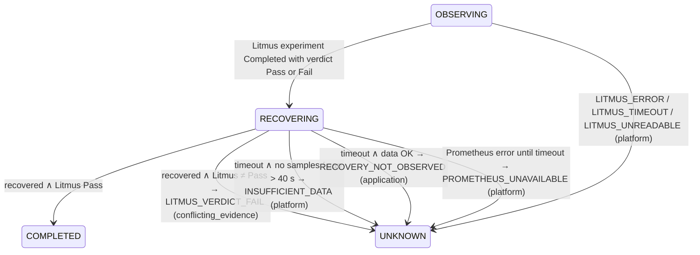

# 08 · Recovery Framework

| | |
|---|---|
| **Purpose** | Specify the recovery algorithm, recovery rules, the UNKNOWN outcome with its causes, timing definitions and timeouts. |
| **Source of truth** | `services/orchestration/recovery.py` (`find_recovery`, `error_check`), `services/orchestration/observation.py`, `services/orchestration/orchestrator.py`, `domain/state_machine.py`, `core/config.py` at `92e33dd`; tests `tests/unit/test_recovery.py`, `tests/api/test_observation.py`, `tests/api/test_orchestration.py`. |
| **Last generated from commit** | `92e33dd` |
| **Dependencies on other files** | [07-evidence-framework](07-evidence-framework.md), [09-scoring-methodology](09-scoring-methodology.md) |

All statements are Level C.

---

## 1. Definitions

| Symbol | Meaning | Source |
|---|---|---|
| `t_f` | Fault start: ChaosEngine creation time (`chaos.created_at`) | `injection.start_injection` |
| `N` | `affected_replicas` | experiment |
| `D` | Baseline desired replicas (`baseline.availability.values.desired_replicas`) | baseline |
| Replacement pod | A pod of the target (name regex) with `kube_pod_created ≥ ⌊t_f⌋` | `find_recovery` |
| `t_c(p)`, `t_r(p)` | Created time and Ready time of pod `p` (1 s resolution) | kube-state-metrics |
| `A = [(t_i, a_i)]` | Raw availability samples at or after `t_f` (available replicas; for a StatefulSet, ready replicas) | Prometheus range vector |
| `k` | `RECOVERY_STABLE_SAMPLES` = 4 | config |
| `g_max` | `RECOVERY_MAX_SAMPLE_GAP_SECONDS` = 40 | config |
| `ε` | `RECOVERY_ERROR_RATIO_TOLERANCE` = 0.01 | config |

## 2. Recovery rule

The target counts as **recovered** if and only if all three criteria hold.

**Criterion 1: replacement.** Let `R` be the replacement pods with a Ready time, sorted by
(`t_r`, name). Require `|R| ≥ N`. Let `R_N` be the first `N` of them.

- `recovered_at` = `t_r` of the N-th pod in `R_N`.
- `fault_observed_at` = min over `R_N` of `t_c`.

**Criterion 2: sustained availability.** Iterate over the samples in `A` with
`t_i ≥ recovered_at`, building a streak:

| Sample condition | Effect on the streak |
|---|---|
| `a_i ≥ D` and gap to the previous streak sample ≤ `g_max` | appended |
| `a_i ≥ D` but gap > `g_max` | streak restarts at this sample |
| `a_i < D` | streak resets to empty |

Recovered when the streak length reaches `k`. Then `confirmed_at` = timestamp of the k-th
streak sample.

**Criterion 3: requests**, only if the baseline `requests` group is OK with a
non-zero request rate. Over the stable window `S = max(1, ⌊confirmed_at − recovered_at⌋)` s,
evaluated at `confirmed_at`:
- requests > 0;
- 5xx ratio ≤ baseline error ratio + ε.

Otherwise the run is NOT_RECOVERED with the check's message.

**Time to recovery (TTR).**

```
TTR = recovered_at − fault_observed_at
    = (Ready time of the N-th replacement) − (earliest creation among those N replacements)
```

It measures **replacement start-up time**. It excludes:
- the Litmus start-up delay before deletion (~13–14 s on this cluster, inference from B1 data);
- termination of the old pod;
- client-side reconvergence;
- the stability confirmation period.

Resolution is 1 s, from pod timestamps.

```mermaid
gantt
    title Recovery timeline (illustrative of the B1 GRACEFUL fragile run at 11:19Z)
    dateFormat HH:mm:ss
    axisFormat %H:%M:%S
    section Litmus
    ChaosEngine created (t_f)          :milestone, 11:19:30, 0s
    Litmus job starts, deletes pod     :11:19:30, 14s
    section Kubernetes
    Replacement created → Ready (TTR 11 s) :11:19:44, 11s
    4 stable availability samples (15 s scrapes) :11:19:55, 50s
    section Client
    Client outage 8.358 s              :crit, 11:19:47, 8s
```



The Gantt chart uses timestamps from B1 telemetry (`research/experiment-results.json`,
record `LIT-66d86b9a`). The stability-sample duration is schematic (4 × 15 s scrapes).

## 3. Outcome determination



### UNKNOWN taxonomy

| `reason_code` | `cause` | Raised in | Condition | Engine stopped? | Scored? |
|---|---|---|---|---|---|
| `LITMUS_ERROR` | platform | `_observe_litmus` | engine `stopped` or verdict Error/Stopped | already stopped | NOT_SCORED |
| `LITMUS_TIMEOUT` | platform | `_observe_litmus` | not finished by `t_f + duration + OBSERVATION_GRACE_SECONDS` (180 s) | yes | NOT_SCORED |
| `LITMUS_UNREADABLE` | platform | `_observe_litmus` | status unreadable past that deadline | yes | NOT_SCORED |
| `PROMETHEUS_UNAVAILABLE` | platform | `_evaluate_recovery` | Prometheus errors persist past the recovery deadline | — | NOT_SCORED |
| `INSUFFICIENT_DATA` | platform | `_raise_not_recovered` | no availability samples, or a gap > `g_max` | — | NOT_SCORED |
| `LITMUS_VERDICT_FAIL` | conflicting_evidence | `_evaluate_recovery` | recovered, but Litmus verdict ≠ Pass | — | NOT_SCORED |
| `RECOVERY_NOT_OBSERVED` | application | `_raise_not_recovered` | data sufficient, rule not met within `RECOVERY_TIMEOUT_SECONDS` (300 s) after Litmus finished | — | **Scored**, recovery = 0, capped at 40 |
| `BASELINE_TIMEOUT` | platform | `Reconciler._give_up` | no CAPTURED baseline within 180 s | — | NOT_SCORED (no baseline) |
| `ORCHESTRATION_TIMEOUT` | platform | `Reconciler._give_up` | run exceeds 1,800 s since `/run` | yes | NOT_SCORED |

Rationale (from the code comments and the score explanation): platform or conflicting
evidence "says nothing reliable about the target's resilience", so such runs are not scored.
An application-cause failure **is** informative and is scored with a cap.

`ORCHESTRATION_TIMEOUT` before the baseline moves to ABORTED instead of UNKNOWN when UNKNOWN is
not a valid transition from the current state (`can_transition`). For example, CREATED and
VALIDATING have no UNKNOWN edge.

## 4. Timeouts and timing parameters

| Parameter (env) | Default | Applies to | Effect on expiry |
|---|---|---|---|
| `ORCHESTRATOR_INTERVAL_SECONDS` | 5 | reconciler tick | — |
| `BASELINE_WINDOW_SECONDS` | 300 | baseline window | — |
| `BASELINE_TIMEOUT_SECONDS` | 180 | BASELINING | UNKNOWN `BASELINE_TIMEOUT` |
| `CHAOS_START_TIMEOUT_SECONDS` | 120 | INJECTING (since engine creation) | INJECTION_FAILED, engine stopped |
| `CHAOS_POLL_INTERVAL_SECONDS` | 2 | manual `/inject` polling | — |
| `OBSERVATION_GRACE_SECONDS` | 180 | OBSERVING: `t_f + duration + grace` | UNKNOWN `LITMUS_TIMEOUT` |
| `RECOVERY_TIMEOUT_SECONDS` | 300 | RECOVERING: after `litmus.finished_at` | UNKNOWN (cause per §3) |
| `RECOVERY_STABLE_SAMPLES` | 4 | criterion 2 | — |
| `RECOVERY_MAX_SAMPLE_GAP_SECONDS` | 40 | criterion 2, data sufficiency | — |
| `RECOVERY_ERROR_RATIO_TOLERANCE` | 0.01 | criterion 3 | — |
| `ORCHESTRATION_MAX_SECONDS` | 1800 | whole run | UNKNOWN or ABORTED `ORCHESTRATION_TIMEOUT` |
| `CLEANUP_GRACE_SECONDS` | 120 | cleanup of a still-running engine | delete anyway (ownership verified) |

**Practical consequence** (inference): with a 15 s scrape interval and `k = 4`,
confirmation needs 4 consecutive samples after `recovered_at`, i.e. at least ~45 s. The
fault also includes the full chaos duration (Litmus waits out `TOTAL_CHAOS_DURATION`). A 30 s
fault therefore cannot complete in much less than about 100 s. Documented: one sandbox run
"COMPLETED in 101 s" (B2).

## 5. State-machine and orchestration consistency

| Item | Finding |
|---|---|
| `domain/state_machine.py` | Defines `UNKNOWN → ABORTED` as allowed. |
| `orchestrator.TERMINAL` | Includes UNKNOWN; `ABORTABLE` excludes it. |
| `/abort` on UNKNOWN | 409 "Experiment is UNKNOWN; nothing to abort". |
| Console (`experiment-state.ts`, `abort-dialog.tsx`) | UNKNOWN shown as terminal ("Undetermined"); no Abort button. |
| **Conclusion** | UNKNOWN is terminal in practice. The `UNKNOWN → ABORTED` edge is unreachable through the API; when describing the model, call it a vestigial transition. |

## 6. Verification

| Aspect | Level C (tests) | Level B |
|---|---|---|
| Recovery rule (streak, dips, gaps, multiple replicas, determinism) | `tests/unit/test_recovery.py` (e.g. `test_single_good_sample_is_not_recovery`, `test_dip_resets_the_streak`, `test_data_gap_resets_the_streak`, `test_multiple_affected_replicas_wait_for_last_replacement`) | — |
| Client counts and outage pattern | `tests/unit/test_recovery.py`, `tests/unit/test_client_outage.py` | O-02 (gauge vs counter agreement) |
| UNKNOWN causes and scoring | `tests/api/test_observation.py`, `tests/unit/test_resilience_score*.py` | — |
| Deadlines, restart resume, abort | `tests/api/test_orchestration.py` | B2: restart and abort runs (`docs/orchestration.md`) |
| TTR values | — | B1: 10–11 s (fragile with 10 s readiness delay), 0–1 s without delay, 1 s for checkout ([15](15-observation-catalogue.md) O-01, O-04, O-05) |

---

## Related documents
[05-system-workflows](05-system-workflows.md) §6–7 · [07-evidence-framework](07-evidence-framework.md) · [09-scoring-methodology](09-scoring-methodology.md) · [20-threats-to-validity](20-threats-to-validity.md)

## Missing information
- No Level A data on how often each UNKNOWN code occurs.
- No measurement of decision latency (fault start → COMPLETED) beyond one documented run.

## Open questions
- Should TTR include the time from deletion to replacement creation, i.e. measure from the old pod's deletion? It does not today.
- Should the stability criterion use client success instead of 15 s availability samples?
