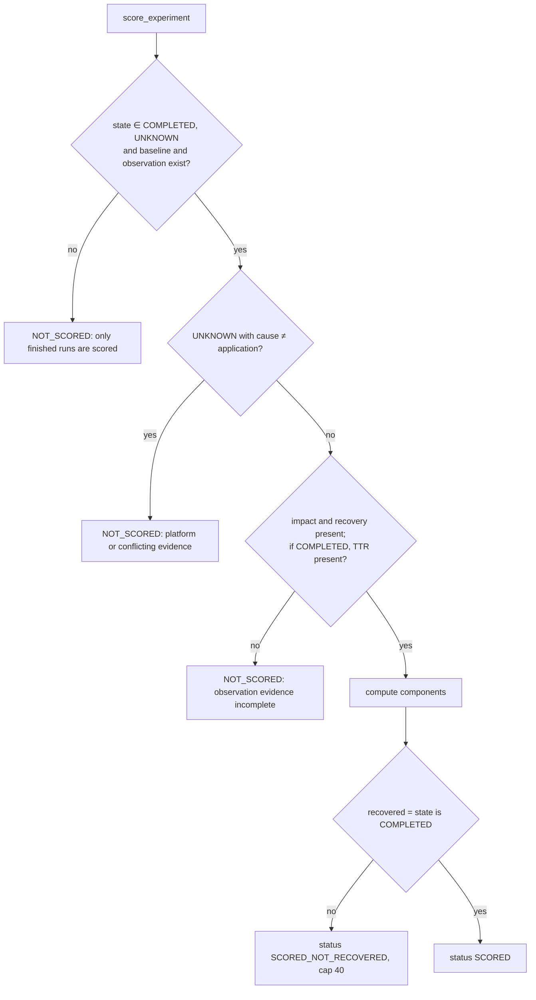
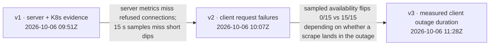

# 09 · Scoring Methodology

| | |
|---|---|
| **Purpose** | The complete, reproducible specification of the Resilience Score: v1, v2, v3, their evolution, weights, thresholds, normalization, missing-data handling, UNKNOWN handling, versioning, mathematical formulation and worked examples. |
| **Source of truth** | `apps/api/app/services/scoring/resilience_score.py` (normative); `docs/scoring/resilience-score-v1.md`, `-v2.md`, `-v3.md` (rationale and documented runs); tests `tests/unit/test_resilience_score.py`, `_v2.py`, `_v3.py`. |
| **Last generated from commit** | `92e33dd` |
| **Dependencies on other files** | [07-evidence-framework](07-evidence-framework.md), [08-recovery-framework](08-recovery-framework.md), [25-research-integrity](25-research-integrity.md) |

The formulas are Level C (implementation). The worked examples in §8 are reconstructions from
documented inputs (B2); they reproduce the documented scores exactly, which is a consistency
check, not new evidence.

---

## 1. Design properties (implemented)

| Property | Implementation |
|---|---|
| Pure, deterministic | No I/O, no randomness, no LLM; inputs are the stored `state`, `baseline`, `observation`, `chaos` |
| Computed once, at the final state | In the same database transaction as COMPLETED or UNKNOWN (`advance_observation`) |
| Explainable | Every component has a raw input record, a normalized value, an effective weight, a contribution and a textual reason; the overall `explanation` lists the points lost |
| Versioned | The stored score records `version`, `weights`, `thresholds`; `GET /score?version=v1|v2` recomputes from the same evidence (not persisted) |
| Never changes an existing version's semantics | Project rule (`CLAUDE.md`); new behaviour gets a new version |

## 2. Eligibility



Not scored at all (`score` column `null`): VALIDATION_FAILED, INJECTION_FAILED, ABORTED.
These never reach the scorer; the console explains why per state.

## 3. Mathematical formulation

Let `C` be the component set of the version. For each component `i ∈ C` the scorer computes
a status `s_i ∈ {SCORED, NOT_APPLICABLE}`, a normalized value `n_i ∈ [0, 1]` (when
SCORED) and a declared weight `w_i`.

Applicable set and effective weights:

```
A = { i ∈ C : s_i = SCORED }
w'_i = 100 · w_i / Σ_{j∈A} w_j      for i ∈ A ;   w'_i = 0 otherwise
```

Raw score, rounding and cap:

```
S_raw = round( Σ_{i∈A} n_i · w'_i , 1 )
S = min(S_raw, 40)   if not recovered (application UNKNOWN)
S = S_raw            otherwise
```

Rating bands (`RATING_BANDS`):

```
Excellent  if S ≥ 90
Good       if 75 ≤ S < 90
Fair       if 50 ≤ S < 75
Poor       if S < 50
```

Linear-down normalization (`_linear_down`), used by most components:

```
lin(x; a, b) = 1                          if x ≤ a
             = 0                          if x ≥ b
             = round(1 − (x − a)/(b − a), 4)   otherwise
```

## 4. Components

### 4.1 Recovery time (all versions)

```
n_recovery = 0                                  if not recovered
           = lin(TTR; 10 s, 120 s)              otherwise
```
TTR is defined in [08](08-recovery-framework.md) §2 (1 s resolution).

### 4.2 Availability (v1, v2; v3 fallback)

```
n_avail = clamp( min_available_replicas / D , 0, 1 )
```
`min_available_replicas` is the minimum over raw samples since the fault (15 s scrapes);
`D` is the baseline's desired replicas. The component is NOT_APPLICABLE if there are no
samples or `D ≤ 0`. The reason text warns that "dips shorter than [the scrape interval]
may be missed".

### 4.3 Error ratio, server side (v1; fallback in v2/v3)

```
r_fault = errors_in_window / requests_in_window
Δ = max(0, r_fault − r_baseline)
n_err = lin(Δ; 0.001, 0.05)
```

| Case | Result |
|---|---|
| Baseline `requests` group not OK, or zero baseline rate | NOT_APPLICABLE |
| Baseline had traffic but no requests in the window | 0 |

### 4.4 Request failures (v2, v3)

Source priority:

| Priority | Source | Used when |
|---|---|---|
| 1 | **Client** | baseline `client` group OK with a non-zero rate **and** client requests recorded in the window |
| 2 | **Server** | otherwise (§4.3 formula). The reason states why: no client baseline, or the generator recorded zero requests (a measurement gap). |
| 3 | NOT_APPLICABLE | neither source available |

Client formula:

```
r_fault = (http_error + connection_error + timeout) / requests     (rounded to 4 decimals)
Δ = round( max(0, r_fault − r_client_baseline), 4 )
n_fail = lin(Δ; 0.001, 0.05)
```

### 4.5 Client outage (v3)

Used when the client data is OK, requests > 0, and the outage measurement status is OK.

```
expected = round( baseline_outage_seconds / baseline_window_seconds · W , 3 )   (0 if no baseline outage)
excess   = round( max(0, outage_seconds − expected), 3 )
n_outage = lin(excess; 1 s, 60 s)
```

`W` is the observation window in seconds. Otherwise it falls back to the availability
component (§4.2) with `raw.source = kubernetes_sampled` and the reason prefixed
`[fallback: …]`.

### 4.6 Restarts (all versions)

```
n_restart = max(0, 1 − restarts_in_window / 2)      (1 restart → 0.5; ≥ 2 → 0)
```
NOT_APPLICABLE if there is no restart data.

### 4.7 Litmus verdict (all versions)

```
n_litmus = 1 if verdict = "Pass" else 0
```

## 5. Versions

| Component | v1 | v2 | v3 (current) |
|---|---|---|---|
| recovery_time | 35 | 35 | 35 |
| availability (sampled) | 25 | 15 | — (fallback only, inside client_outage) |
| error_ratio (server 5xx) | 20 | — | — |
| request_failures (client, server fallback) | — | 30 | 30 |
| client_outage (measured duration) | — | — | 15 |
| restarts | 10 | 10 | 10 |
| litmus_verdict | 10 | 10 | 10 |

| Threshold (`Thresholds`, `OutageThresholds`) | Value |
|---|---|
| `recovery_fast_seconds` / `recovery_slow_seconds` | 10 / 120 |
| `error_ratio_tolerated_increase` / `error_ratio_severe_increase` | 0.001 / 0.05 |
| `restarts_zero_at` | 2 |
| `not_recovered_cap` | 40 |
| `outage_tolerated_seconds` / `outage_severe_seconds` (v3) | 1 / 60 |

### Evolution and rationale (documented, B2)



| Transition | Problem documented | Evidence cited in the docs |
|---|---|---|
| v1 → v2 | Server-side 5xx cannot see connections refused or reset during termination; outages shorter than the scrape interval are invisible to gauges. | `resilience-score-v2.md`: a FORCE run scored v1 100.0 despite 22 client failures (sandbox, with warm-up). |
| v2 → v3 | v2's availability component depends on scrape timing. | `resilience-score-v3.md`: GRACEFUL 8.358 s outage scored 0/15 sampled availability, FORCE 10.479 s outage 15/15; v2 ordering reversed (67.2 vs 79.2); v3 orders them by the measured outage (80.4 vs 76.8). |

**Decision rule recorded in the docs:** the new measurement changed what a component means,
so a new version was created instead of changing an old one.

## 6. Missing-data and UNKNOWN handling (summary)

| Situation | Handling |
|---|---|
| A component has no data | NOT_APPLICABLE → excluded; weights re-normalized; listed in the explanation |
| Client data missing or invalid (v3 outage) | fall back to sampled availability, stated in the reason |
| Client baseline missing or zero requests (request failures) | fall back to the server 5xx ratio, stated in the reason |
| Platform UNKNOWN, conflicting evidence | NOT_SCORED (`score: null`) |
| Application UNKNOWN (not recovered) | scored with recovery = 0, then capped at 40, `SCORED_NOT_RECOVERED` |
| Incomplete observation evidence | NOT_SCORED |
| Dashboard aggregation | only current-version numeric scores; older versions and NOT_SCORED counted separately (`services/analysis/history.py`) |

## 7. Stored score object

```json
{
  "version": "v3",
  "status": "SCORED | SCORED_NOT_RECOVERED | NOT_SCORED",
  "score": 80.4,
  "rating": "Good",
  "explanation": "Resilience Score 80.4/100 (Good) for pod-delete (GRACEFUL). Lost points: …",
  "components": [
    {"name": "recovery_time", "status": "SCORED", "raw": {…}, "normalized": 0.9909,
     "weight": 35, "reason": "…", "effective_weight": 35.0, "contribution": 34.68}
  ],
  "cap_applied": null,
  "weights": {"recovery_time": 35, "client_outage": 15, "request_failures": 30, "restarts": 10, "litmus_verdict": 10},
  "thresholds": {"recovery_fast_seconds": 10, …, "outage_tolerated_seconds": 1, "outage_severe_seconds": 60},
  "inputs": {"state": "COMPLETED", "result": {…}, "fault": {"type": "pod-delete", "pod_delete_mode": "GRACEFUL", …}}
}
```

The shape follows `score_experiment` and `_not_scored`. The numbers are from worked example A.

## 8. Worked examples (reconstructions from documented inputs)

Inputs are from `docs/scoring/resilience-score-v3.md` ("Real runs") and the post-hoc
telemetry in `research/experiment-results.json`. The target is `resilience-sandbox/fragile`:
1 replica, 10 s readiness delay, 30 s pod-delete. All components are applicable, so
`w' = w`.

### Example A: GRACEFUL run (`66d86b9a`, 11:19Z)

| Input | Value |
|---|---|
| TTR | 11 s (created 11:19:44 → Ready 11:19:55) |
| Client | 20 failed / 678 requests; baseline failure ratio 0 |
| Client outage | 8.358 s CONTINUOUS; baseline outage 0 s |
| Min sampled availability | 0/1 |
| Restarts | 0 |
| Litmus | Pass |

| Component | v3 computation | v3 pts | v2 pts | v1 pts |
|---|---|---|---|---|
| recovery_time | lin(11; 10, 120) = 0.9909 × 35 | 34.68 | 34.68 | 34.68 |
| client_outage | excess 8.358 → lin(8.358; 1, 60) = 0.8753 × 15 | 13.13 | — | — |
| availability | 0/1 = 0 | — | 0 × 15 = 0 | 0 × 25 = 0 |
| request_failures | Δ = 20/678 = 0.0295 → lin(0.0295; 0.001, 0.05) = 0.4184 × 30 | 12.55 | 12.55 | — |
| error_ratio (server) | 0 5xx (inferred) → 1 × 20 | — | — | 20 |
| restarts | 0 → 1 × 10 | 10 | 10 | 10 |
| litmus_verdict | Pass → 1 × 10 | 10 | 10 | 10 |
| **Score** | | **80.4 (Good)** | **67.2 (Fair)** | **74.7 (Fair)** |
| Documented | | 80.4 | 67.2 | 74.7 |

### Example B: FORCE run (`7ea2e0f7`, 11:26Z)

| Component | v3 computation | v3 | v2 | v1 |
|---|---|---|---|---|
| recovery_time | TTR 10 s → 1.0 × 35 | 35 | 35 | 35 |
| client_outage | excess 10.479 → 0.8393 × 15 | 12.59 | — | — |
| availability | 1/1 (dip missed by scrapes) | — | 15 | 25 |
| request_failures | 23/658 = 0.0350 → lin(0.0350; 0.001, 0.05) = 0.3061 × 30 | 9.18 | 9.18 | — |
| error_ratio | 0 5xx (inferred) → 20 | — | — | 20 |
| restarts / litmus | 10 + 10 | 20 | 20 | 20 |
| **Score** | | **76.8 (Good)** | **79.2 (Good)** | **100.0 (Excellent)** |
| Documented | | 76.8 | 79.2 | 100.0 |

The server-side 5xx count for the v1 columns is inferred (= 0); the v1 documented values are
only consistent with zero.

### Example C: not recovered (hypothetical, formula illustration only)

All other components at 1.0 with `n_recovery = 0`: `S_raw = 65.0` → capped at **40.0**
(Poor), `cap_applied = {cap: 40, uncapped_score: 65.0}`. This is hypothetical; do not
present it as observed.

### Example D: missing client data (hypothetical)

Target without a client and without server metrics (e.g. `shop/cart-redis`):
- `request_failures` → NOT_APPLICABLE;
- `client_outage` → fallback to sampled availability.

Weights are re-normalized over {recovery 35, client_outage (fallback) 15, restarts 10,
litmus 10} = 70, so the effective weights become 50, 21.43, 14.29 and 14.29.

## 9. Known methodological limitations

| Limitation | Where it matters |
|---|---|
| Weights and thresholds are author-chosen, not calibrated | Construct validity ([20](20-threats-to-validity.md)) |
| `request_failures` and `client_outage` measure the same outage from two angles (overlap) | `resilience-score-v3.md` limitations |
| The failure ratio is diluted by window length (`W` grows until the decision) | v2/v3 |
| Baseline contamination: an outage within the 300 s baseline inflates `expected` and therefore lowers `excess` | Back-to-back runs (B1: 7 cases) |
| The Litmus component is nearly constant without probes | v1–v3 |
| A score describes one run; no aggregation across runs | All |

---

## Related documents
[07-evidence-framework](07-evidence-framework.md) · [08-recovery-framework](08-recovery-framework.md) · [15-observation-catalogue](15-observation-catalogue.md) O-07 · [16-final-experiment-matrix](16-final-experiment-matrix.md) V1 · [20-threats-to-validity](20-threats-to-validity.md)

## Missing information
- No sensitivity analysis of weights or thresholds.
- No Level A distribution of scores.
- The full stored component breakdowns of the documented runs were not retained; only the documented points above.

## Open questions
- Should the paper present v3 alone, or the v1 → v3 evolution? Recommended: v3 in the method section, and the evolution as a design-science narrative with V1 results.
- Should a v4 address baseline contamination (e.g. exclude windows with recent faults)? That would be a new version.
