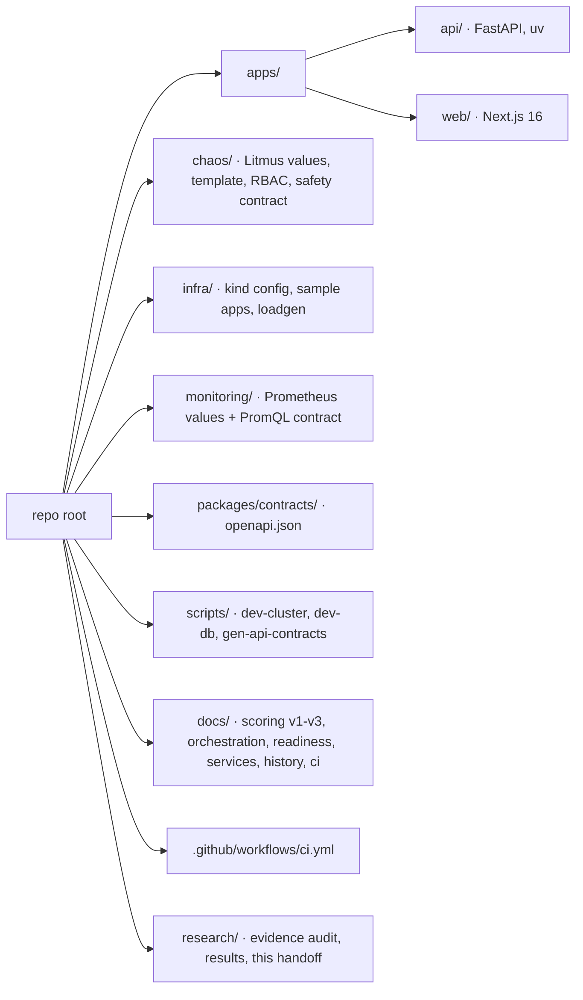

# 10 · Implementation

| | |
|---|---|
| **Purpose** | Implementation-level view: repository structure, major modules, API, frontend, backend, infrastructure, and a precise status of what is implemented, verified and incomplete. |
| **Source of truth** | Repository tree and code at `92e33dd`; test suites; `.github/workflows/ci.yml`. |
| **Last generated from commit** | `92e33dd` |
| **Dependencies on other files** | [appendix/repository-map](appendix/repository-map.md) (full file map), [04-component-design](04-component-design.md), [11-technology-stack](11-technology-stack.md) |

---

## 1. Repository structure

| Directory | Contents | Status |
|---|---|---|
| `apps/api/app` | Backend source (§3) | Implemented |
| `apps/api/alembic` | 8 migrations, head `08697f19aec0` | Implemented |
| `apps/api/tests` | 431 tests (`unit/`, `api/`) | Implemented |
| `apps/web/src` | Console (§4), 39 tests | Implemented |
| `chaos/` | `litmus/values.yaml`, `templates/pod-delete.yaml`, `rbac/pod-delete-rbac.yaml`, `policies/safety-policy.md` | Implemented |
| `infra/kind`, `infra/sample-app` | Cluster config, `shop.yaml`, `sandbox.yaml`, `loadgen/loadgen.py` | Implemented |
| `infra/helm`, `infra/namespaces` | empty | Not implemented |
| `monitoring/prometheus` | `values.yaml`, `queries.md` | Implemented |
| `monitoring/alertmanager`, `monitoring/grafana` | empty | Not implemented |
| `packages/contracts` | `openapi.json` (generated); `*.py`/`*.ts` one-line stubs | Partially (only OpenAPI is real) |
| `scripts/` | `dev-cluster.sh`, `dev-db.sh`, `gen-api-contracts.sh` | Implemented |
| `docs/` | Methodology and runbooks | Implemented |

## 2. Major modules

| Module | Lines of responsibility | Key file(s) |
|---|---|---|
| Domain | Enums, target and spec, state machine, safety policies | `domain/experiment.py`, `domain/state_machine.py`, `domain/safety_policy.py` |
| Integrations | Kubernetes (read-only), Prometheus (read-only), LitmusChaos (own engines) | `integrations/*.py` |
| Lifecycle services | Validation, baseline, injection, observation, recovery, orchestration | `services/orchestration/*.py` |
| Safety | Static and cluster checks | `services/safety/policy_evaluator.py` |
| Scoring | v1/v2/v3 | `services/scoring/resilience_score.py` |
| Analysis | History, dashboard, services | `services/analysis/history.py`, `services/analysis/services.py` |
| Operability | Readiness, DB error mapping | `services/readiness.py`, `api/errors.py` |
| API | Routes, schemas | `api/routes/*.py`, `schemas/*.py` |
| Persistence | ORM, session, migrations | `db/*`, `alembic/` |

## 3. Backend

- **Entry point.** `main.py`: `FastAPI(lifespan=…)`, error handlers, routers (`health`, `ready`, `history`, `experiments`, `services`). The history router is registered before the experiments router so that `/experiments/history` is not parsed as an id. The lifespan starts the reconciler thread when `ORCHESTRATOR_ENABLED` is true.
- **Configuration.** `core/config.py` `Settings` (pydantic-settings; env vars or `apps/api/.env`). Full list: [12](12-experimental-environment.md) §8.
- **Dependency injection.** FastAPI dependencies; tests override them with fakes (`tests/conftest.py`: `FakeKubernetes`, `FakePrometheus`, `FakeChaos`, a `Clock`; in-memory SQLite with `StaticPool`).
- **Endpoints.** 16 operations; see [appendix/api-overview](appendix/api-overview.md).

## 4. Frontend

| Route | Component | Data |
|---|---|---|
| `/` | `overview/overview-dashboard.tsx`, `score-trend.tsx` | `GET /dashboard/summary` |
| `/experiments` | `history/history-view.tsx` | `GET /experiments/history` |
| `/experiments/new` | `experiment/builder/*` | `GET /services`, `POST /experiments`, `/validate`, `/run` |
| `/experiments/[id]` | `experiment/room/*` | `GET /experiments/{id}`, `POST /abort` |
| `/reports`, `/reports/[id]` | `history-view` (finished states), `report/report-view.tsx` | history, `GET /experiments/{id}` |
| `/services`, `/services/[ns]/[kind]/[name]` | `services/*` | `GET /services`, `GET /services/{…}` |
| `/settings` | `app/settings/page.tsx` | build-time proxy target, `/ready` |

Shared: `components/shell/*` (sidebar with the readiness indicator, breadcrumbs),
`components/ui/*` (primitives), `lib/*`.

## 5. Infrastructure

| Item | File | Notes |
|---|---|---|
| kind cluster | `infra/kind/cluster.yaml` | One control-plane node; port mapping 127.0.0.1:9090 → NodePort 30090 |
| Sample app | `infra/sample-app/shop.yaml` | namespace `shop`: frontend, checkout, cart-redis, loadgen + Services |
| Sandbox | `infra/sample-app/sandbox.yaml` | namespace `resilience-sandbox` (label `autoresilience.io/sandbox=true`), `fragile` |
| Load generator | `infra/sample-app/loadgen/loadgen.py` | mounted via ConfigMap `loadgen-script`; restarted on script change (checksum annotation) |
| Prometheus | `monitoring/prometheus/values.yaml` | chart 29.35.0; server + kube-state-metrics; Alertmanager, node-exporter and pushgateway **disabled** |
| Litmus | `chaos/litmus/values.yaml` | chart litmus-core 3.31.1; operator only; exporter disabled |
| Bootstrap | `scripts/dev-cluster.sh` | idempotent; pre-pulls images with `crictl`; applies chaos prerequisites per namespace |
| Database | `scripts/dev-db.sh` | Docker `postgres:17-alpine`, volume `autoresilience-pgdata`, then `alembic upgrade head` |
| Contract | `scripts/gen-api-contracts.sh` | OpenAPI export + `openapi-typescript` |
| CI | `.github/workflows/ci.yml` | 5 jobs; see [11](11-technology-stack.md) §6 |

## 6. Implementation status

### 6.1 Verified functionality (Level C)

| Capability | Verified by |
|---|---|
| State machine transitions | `tests/unit/test_state_machine.py` |
| Safety policies and evaluator | `tests/unit/test_safety_policy.py`, `test_policy_evaluator.py`, `tests/api/test_validation.py`, `test_sandbox_policy.py` |
| Read-only Kubernetes adapter | `tests/unit/test_kubernetes_adapter.py` |
| Prometheus client | `tests/unit/test_prometheus_client.py` |
| Baseline capture | `tests/unit/test_baseline.py`, `tests/api/test_baseline.py` |
| Injection (guards, timeouts, single engine) | `tests/api/test_injection.py`, `test_pod_delete_mode.py`, `tests/unit/test_chaos_provider.py` |
| Observation, recovery, client outage | `tests/api/test_observation.py`, `tests/unit/test_recovery.py`, `test_client_outage.py` |
| Scoring v1/v2/v3 | `tests/unit/test_resilience_score.py`, `_v2.py`, `_v3.py` |
| Orchestration (auto run, deadlines, restart, abort, cleanup) | `tests/api/test_orchestration.py` |
| History, dashboard, services, readiness, DB errors | `tests/api/test_history.py`, `test_services.py`, `test_ready.py`, `test_errors.py` |
| Builder, readiness indicator, history UI, live room | `apps/web/src/**/*.test.tsx` (39 tests; mutation-checked: 9 deliberately broken behaviours were each caught) |
| Contract consistency | CI `contract` job; determinism checked locally |
| Migrations match the models | CI `migrations` job (`alembic upgrade head` + `alembic check`) |

### 6.2 Verified on the real environment (Level B)

The end-to-end pipeline ran on kind during development (validation → injection → observation
→ recovery → score; restart; abort; cleanup). See [14](14-current-evidence.md).

### 6.3 Incomplete or not implemented

| Item | Current implementation | Future implementation |
|---|---|---|
| Fault types other than pod-delete | Enum values exist; validation rejects them | Engine builders and policies per fault ([21](21-future-work.md)) |
| Live safety monitor | Placeholder `services/safety/live_monitor.py` | Mid-run abort on live signals |
| Timeline service | Placeholder `services/orchestration/timeline.py`; the timeline lives in `orchestration.events` | Dedicated phase-event recording |
| Coverage analytics | Placeholders `services/coverage/coverage_service.py`, `routes/coverage.py`, `schemas/coverage.py` | Targets × faults × experiments matrix |
| Safety-policy API and persistence | Placeholders `routes/safety.py`, `schemas/safety.py`, `db/models/safety_policy.py` | Read-only policy endpoint; persisted policies |
| Structured logging | Placeholder `core/logging.py` | Logging configuration |
| Server-side reports and export | Not present (console print only) | Report artefacts |
| Alertmanager, Grafana, Helm deployment of AutoResilience | Empty directories; Alertmanager disabled in Prometheus values | — |
| Authentication | None | — |
| Multi-replica API | In-process locks assume one process | DB row locks (`SELECT … FOR UPDATE SKIP LOCKED` suggested in `docs/orchestration.md`) |

---

## Related documents
[03-system-architecture](03-system-architecture.md) · [04-component-design](04-component-design.md) · [11-technology-stack](11-technology-stack.md) · [21-future-work](21-future-work.md) · [appendix/repository-map](appendix/repository-map.md) · [appendix/api-overview](appendix/api-overview.md)

## Missing information
- No code metrics (lines of code, complexity) have been computed; compute them with a tool before quoting any.
- CI has not run on GitHub yet (Not verified from implementation).

## Open questions
- Should the scaffold placeholders be removed before publication, to avoid suggesting unimplemented features?
