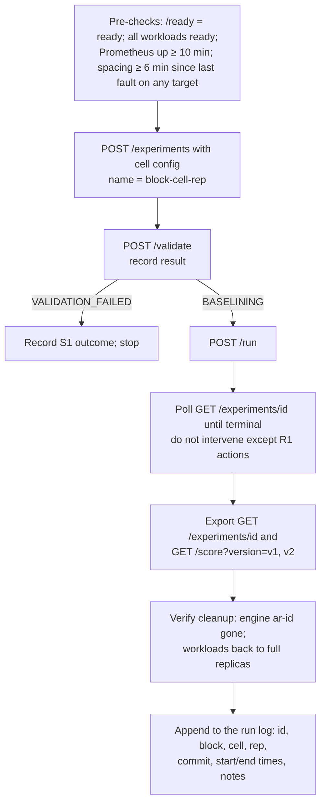

# 13 · Experimental Methodology

| | |
|---|---|
| **Purpose** | The methodology for the evaluation: variables, metrics, protocol, measurement procedure, repetition strategy, threat control and data management. |
| **Source of truth** | Implementation (what can be varied and measured); lessons from current evidence ([14](14-current-evidence.md)). This file is a **plan** (Level D) until executed. |
| **Last generated from commit** | `92e33dd` |
| **Dependencies on other files** | [16-final-experiment-matrix](16-final-experiment-matrix.md), [12-experimental-environment](12-experimental-environment.md), [25-research-integrity](25-research-integrity.md) |

---

## 1. Units

| Term | Definition |
|---|---|
| **Experiment (run)** | One AutoResilience experiment record, created through the API and started with `POST /run` (automatic orchestration). |
| **Cell** | One combination of independent-variable levels. |
| **Block** | A group of cells run under the same environment state and commit (E1, E2, …; [16](16-final-experiment-matrix.md)). |
| **Campaign** | All blocks, executed on one commit. |

## 2. Independent variables

| Variable | Levels | How set |
|---|---|---|
| Target redundancy / workload | fragile (1 replica, sandbox), checkout (2), frontend (3) | Target in `POST /experiments` |
| Deletion mode | GRACEFUL, FORCE | `pod_delete_mode` |
| Readiness delay (fragile only) | 0, 5, 10, 20 s | Edit `initialDelaySeconds` in `infra/sample-app/sandbox.yaml`, apply, wait for the rollout (E4 only) |
| Unsafe configuration (S1) | system namespace, replicas > max, single-replica under default, duration > max, missing workload | Request fields |
| Interruption (R1) | abort in OBSERVING, API restart in OBSERVING, Litmus timeout | Operator action, process restart, `OBSERVATION_GRACE_SECONDS` |
| Scoring version (V1) | v1, v2, v3 | `GET /score?version=` (no new runs) |

## 3. Dependent variables (metrics)

All are read from the stored experiment record. The JSON paths are given so that extraction
scripts are unambiguous.

| Metric | Definition | JSON path |
|---|---|---|
| Final state | terminal state | `state` |
| Outcome code and cause | why UNKNOWN or COMPLETED | `observation.result.reason_code`, `.cause`; `orchestration.result` |
| TTR (s) | N-th replacement Ready − earliest creation ([08](08-recovery-framework.md)) | `observation.recovery.time_to_recovery_seconds` |
| Client outage (s) | exact counter increase | `observation.impact.client.outage.outage_seconds` |
| Outage pattern | NONE / CONTINUOUS / INTERMITTENT / INSUFFICIENT_DATA | `observation.impact.client.outage.pattern` |
| Client failures, requests | exact counts by outcome | `observation.impact.client.{failed,requests,connection_error,timeout,http_error}` |
| Client failure ratio | failed / requests | `observation.impact.client.failure_ratio` |
| Sampled min availability | min of 15 s samples since the fault | `observation.impact.min_available_replicas`, `availability_dip_observed` |
| Server 5xx | increase over the window | `observation.impact.errors_in_window`, `requests_in_window` |
| Restarts | in the window | `observation.impact.restarts_in_window` |
| Litmus verdict | Pass / Fail / … | `observation.litmus.verdict` |
| Score, rating, components | v3 stored; v1/v2 recomputed | `score.*`; `GET /score?version=` |
| Decision latency (s) | final-state time − `/run` time | `orchestration.state_since[<final>]` − `orchestration.requested_at` |
| Safety outcome (S1) | VALIDATION_FAILED and which checks failed; whether any engine was created | `validation_result.*`; `chaos` is null |
| Containment | deleted pods ⊆ `chaos.target_pods`; exactly one engine per run | `chaos.target_pods`; cluster audit |

## 4. Controlled variables

| Variable | Control |
|---|---|
| Code version | One commit for the whole campaign; record the hash |
| Duration | 30 s for E1–E4 (the value used in all prior runs); fixed |
| Affected replicas | 1 (the policy maximum) |
| Load | Load generator: 10 req/s per target, 1 s timeout, new connection per request (unchanged) |
| Cluster state | All workloads at full replicas and Ready before each run |
| Prometheus | Running ≥ 10 min before the first baseline; no restarts during a block |
| Baseline independence | **≥ 6 min** between consecutive runs on the same target (see §6) |
| Orphans | Delete pre-existing orphan ChaosEngines before the campaign, or record them |
| Host load | No other heavy workloads; record Docker resource settings |

## 5. Protocol per run

Use the API (scripted) for the campaign, so that timing and inputs are identical. Use the
console for at least one demonstration run per block for the figures, and mark those runs.

## 6. Measurement procedure and its pitfalls

| Pitfall | Evidence it matters | Rule |
|---|---|---|
| Baseline contamination | 7 of the 13 unattributed fragile disruptions (B1) had an earlier outage inside their 300 s pre-fault window, which inflates v3's `expected` outage | Spacing ≥ `BASELINE_WINDOW_SECONDS` + run duration ≈ 6 min |
| Scrape-phase dependence | Sampled availability caught the dip in 9/17 (B1) | Report sampled availability, but analyse client measures as primary |
| Prometheus restart | Baseline needs ≥ 4 samples | Wait ≥ 1 min after any restart (10 min recommended) |
| Ephemeral telemetry | 2 d retention, no PV | Export per run (§8) |
| Litmus start-up latency | ~13–14 s between engine creation and deletion | Treat it as constant; TTR excludes it by definition |
| Load generator restart | Counter resets → `INSUFFICIENT_DATA` | Do not restart loadgen within a block |

## 7. Repetition strategy

| Block | Repetitions per cell | Rationale |
|---|---|---|
| E1, E2 | 10 | Enough to estimate the median and IQR of outage and TTR; prior B1 dispersion is small (outage sd ≈ 1.0 s) |
| E3, E4 | 5 | Secondary factors |
| S1, R1 | 3 | Deterministic expected outcomes; repetitions check stability |
| C1 | 3 per level | Calibration |

**Randomisation.** Interleave GRACEFUL and FORCE (alternate ABAB…), and randomise the cell order
within a block, so time-of-day or drift effects do not align with a factor.

**Statistics (planned).**
- Report median, IQR, min and max per cell; n is small, so avoid normality assumptions.
- Compare modes with a Mann–Whitney U test or a bootstrap CI of the median difference.
- Report the detection rate (sampled vs client) as a proportion with a Wilson CI.
- Use no inferential statistics for S1 and R1; report counts.

These are recommendations; no statistics have been computed (Level D).

## 8. Data management (mandatory, to prevent the loss that happened in development)

| Artefact | Location (proposed) | When |
|---|---|---|
| Run log (CSV) | `research/raw/<campaign>/runs.csv` | after each run |
| Experiment JSON | `research/raw/<campaign>/experiments/<id>.json` | after each run |
| Recomputed scores | `research/raw/<campaign>/scores/<id>-v1.json`, `-v2.json` | after each run |
| Database dump | `research/raw/<campaign>/db-<block>.sql` (`pg_dump`) | after each block |
| Cluster state | `research/raw/<campaign>/cluster-<block>.txt` (`kubectl get deploy,sts,pods,chaosengines -A -o wide`) | before and after each block |
| Prometheus | snapshot (admin API, if enabled) or targeted raw-query exports per run | after each block |
| Environment | commit hash, `kind version`, `kubectl version`, Docker resources | campaign start |

Derived tables and figures must be generated by committed scripts from these raw files
([17](17-required-figures.md), [18](18-required-tables.md)).

## 9. Threat control summary

| Threat ([20](20-threats-to-validity.md)) | Control in this protocol |
|---|---|
| Development-build variation | Single commit |
| Baseline contamination | Spacing rule |
| Order or drift effects | Interleaving and randomisation |
| Small n | Planned repetitions; non-parametric summaries |
| Lost data | §8 exports |
| Artificial warm-up | Reported explicitly; E4 varies it |
| Single client vantage point | Stated as a limitation; not controlled |

---

## Related documents
[14-current-evidence](14-current-evidence.md) · [16-final-experiment-matrix](16-final-experiment-matrix.md) · [18-required-tables](18-required-tables.md) · [20-threats-to-validity](20-threats-to-validity.md) · [25-research-integrity](25-research-integrity.md)

## Missing information
- Execution scripts for the campaign do not exist yet.
- Whether the Prometheus admin API (needed for TSDB snapshots) is enabled has not been checked (Not verified from implementation).

## Open questions
- Is 30 s the right fault duration? It only affects the observation window length (one deletion round), not the fault itself.
