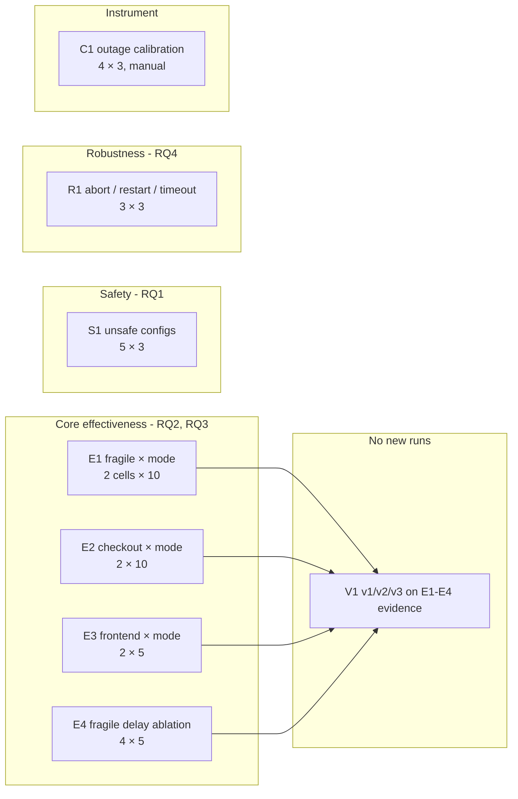

# 16 · Final Experiment Matrix

| | |
|---|---|
| **Purpose** | The complete future experiment plan: IDs, purpose, variables, repetitions, expected outputs and status. |
| **Source of truth** | Implementation capabilities ([12](12-experimental-environment.md), [06](06-safety-framework.md)); gaps in [14](14-current-evidence.md); protocol in [13](13-experimental-methodology.md). This is a plan (Level D). |
| **Last generated from commit** | `92e33dd` |
| **Dependencies on other files** | [13-experimental-methodology](13-experimental-methodology.md), [02-research-context](02-research-context.md), [18-required-tables](18-required-tables.md) |

**Status legend:** `PLANNED` (not run) · `READY` (no code or infra change needed) ·
`NEEDS-CHANGE` (manifest or config change required) · `DONE`. **Nothing is DONE.**

---

## 1. Overview

## 2. Matrix

| ID | Purpose | Target / policy | Independent variables (levels) | Fixed | Reps per cell | Runs | Expected outputs | RQ / H | Status |
|---|---|---|---|---|---|---|---|---|---|
| **E1** | Single-replica outage, recovery and score; mode effect | `resilience-sandbox/fragile` (sandbox), 1 replica, 10 s delay | mode: GRACEFUL, FORCE | 30 s, 1 affected, default timings | 10 | 20 | TTR, outage s and pattern, failures, sampled min availability, v3 score and components, final state, decision latency | RQ2, RQ3; H2a, H2c, H3b | READY |
| **E2** | Redundancy masks client impact | `shop/checkout` (default), 2 replicas | mode: GRACEFUL, FORCE | same | 10 | 20 | same; expected outage 0 | RQ2, RQ3; H2b, H3b | READY |
| **E3** | Generality across image and metrics; server-metrics-absent path | `shop/frontend` (default), 3 replicas, nginx | mode: GRACEFUL, FORCE | same | 5 | 10 | same; `requests` group UNAVAILABLE | RQ2, RQ3; H2b | READY |
| **E4** | Score sensitivity to a controlled start-up delay | fragile | `initialDelaySeconds`: 0, 5, 10, 20 | GRACEFUL, 30 s | 5 | 20 | outage vs delay; v3 vs delay | RQ3; H2a, H3a | NEEDS-CHANGE (edit `sandbox.yaml` per level; record the template hash) |
| **S1** | Safety blocking without cluster mutation | various | scenario: (a) `kube-system/coredns`; (b) checkout, affected = 2; (c) `shop/cart-redis` (1 replica, default); (d) checkout, duration 600 s; (e) non-existent `shop/nope` | — | 3 | 15 | VALIDATION_FAILED; failing check names and messages; `chaos` null; no pod restarts in the target | RQ1; H1 | READY |
| **R1** | Robustness of the lifecycle | fragile | (a) abort in OBSERVING; (b) API restart in OBSERVING; (c) Litmus timeout via `OBSERVATION_GRACE_SECONDS=1` | — | 3 | 9 | (a) ABORTED + engine stopped; (b) COMPLETED + exactly 1 engine; (c) UNKNOWN `LITMUS_TIMEOUT`, NOT_SCORED; cleanup done in all | RQ4; H4 | READY ((c) needs an env change for that sub-block) |
| **C1** | Instrument calibration | fragile (manual, outside AutoResilience) | scale to 0 for 5, 10, 20, 30 s, then back to 1 | — | 3 | 12 | client outage vs commanded duration (+ readiness delay) | RQ2 (instrument) | READY (manual procedure) |
| **V1** | Methodology comparison | E1–E4 stored evidence | version: v1, v2, v3 (`GET /score?version=`) | — | — | 0 | per-run scores per version; rank agreement; ordering reversals | RQ3; H3c | READY after E1–E4 |

**Totals:**
- 79 AutoResilience fault runs (E1–E4: 70; R1: 9).
- 15 validation-only runs (S1).
- 12 manual probes (C1).

At ≥ 6 min spacing per fault run, E1–E4 + R1 ≈ 8–10.5 h, plus E4 rollouts.

## 3. Cell order and scheduling

| Rule | Detail |
|---|---|
| Interleave modes | E1, E2, E3: G, F, G, F, … |
| Randomise | cell order within each block (record the seed) |
| Spacing | ≥ 6 min between fault runs on the **same** target; different targets may run back-to-back only if their baselines do not overlap a fault on the same target |
| Blocks | one block per session; each block starts with environment checks ([12](12-experimental-environment.md) §10) |
| E4 | change the delay, wait for the rollout and ≥ 5 min of steady state, then run 5 repetitions |
| R1(b) | kill the API process while OBSERVING, restart it within 30 s, keep the reconciler enabled |
| C1 | do not run AutoResilience during C1; read the client counters and gauges directly from Prometheus |

## 4. Expected outputs → tables and figures

| Block | Tables ([18](18-required-tables.md)) | Figures ([17](17-required-figures.md)) |
|---|---|---|
| E1–E3 | T-09 per-cell results | F-12 distributions, F-15 components |
| E4 | T-10 ablation | F-16 delay vs outage and score |
| S1 | T-11 safety outcomes | — |
| R1 | T-13 robustness | F-08 lifecycle with an interruption (optional) |
| C1 | T-12 calibration | F-14 measured vs commanded |
| V1 | T-14 version comparison | F-15 |
| all | T-15 detection rates (sampled vs client) | F-13 |

## 5. Exit criteria

| Criterion | Requirement |
|---|---|
| Completeness | Every planned run has an exported JSON record and an appended run-log row |
| Validity | No UNKNOWN with cause `platform` in E1–E4; if any occur, investigate, record and re-run (not silently dropped) |
| Cleanliness | No orphan engines after each block; workloads at full replicas |
| Reproducibility | Campaign commit recorded; analysis scripts committed |

## 6. Optional extensions (only if time permits)

| ID | Purpose | Needs |
|---|---|---|
| E5 | StatefulSet target | A sandbox StatefulSet with a client target (new manifest) |
| E6 | Longer outages / not-recovered path | e.g. a failing readiness probe in the sandbox, to exercise `RECOVERY_NOT_OBSERVED` and the cap of 40 |
| E7 | Multi-node kind | `cluster.yaml` with worker nodes; changes the environment, so report it separately |

---

## Related documents
[13-experimental-methodology](13-experimental-methodology.md) · [17-required-figures](17-required-figures.md) · [18-required-tables](18-required-tables.md) · [19-discussion-framework](19-discussion-framework.md) · [20-threats-to-validity](20-threats-to-validity.md)

## Missing information
- No campaign scripts exist yet.
- E4 requires manifest edits that would change the committed sandbox; use a branch, or record the patch.

## Open questions
- Is 10 repetitions per cell acceptable for the target venue? Increase it if a statistical comparison of modes is a headline claim.
