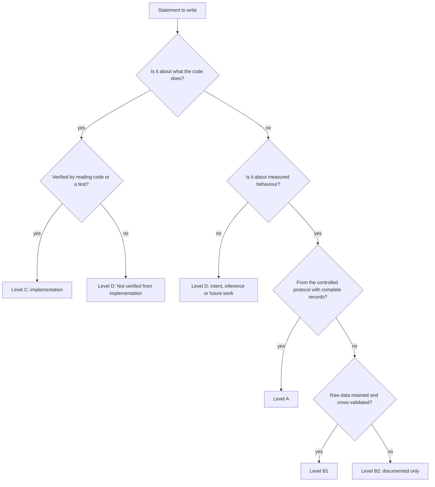

# 25 · Research Integrity

| | |
|---|---|
| **Purpose** | Define the evidence levels used across this knowledge base, and state exactly what may and may not be claimed in any paper, dissertation or presentation about AutoResilience. |
| **Source of truth** | `research/experiment-results.json` (evidence categories), the repository (implementation), `apps/api/tests` and `apps/web/src/**/*.test.tsx` (verification). |
| **Last generated from commit** | `92e33dd` |
| **Dependencies on other files** | [14-current-evidence](14-current-evidence.md), [15-observation-catalogue](15-observation-catalogue.md), [20-threats-to-validity](20-threats-to-validity.md) |

Read this file before writing any sentence that contains a number, a comparison or the word
"shows". Every other document labels its statements with the levels defined here.

---

## 1. Statement types

Every statement in this knowledge base is exactly one of the following. They must never be
blended into a single sentence without labels.

| Type | Meaning | Example | Typical wording in a paper |
|---|---|---|---|
| **Implementation** | What the code does, verified by reading the repository at the stated commit. | "The scorer re-normalizes weights over applicable components." | "AutoResilience re-normalizes…" (present tense, system description) |
| **Observation** | Something seen on the real system that was not produced by a controlled protocol. | "In 17 single-replica deletions, sampled availability registered the dip 9 times." | "During development we observed…" / "In exploratory runs…" |
| **Experimental evidence** | A result of a pre-defined, repeated protocol with complete records (§16 matrix). | *(none exists yet)* | "Across n = 10 runs per configuration…" |
| **Inference** | A conclusion drawn from implementation or observations that was not directly measured. | "Validation must have passed for these runs, because an engine is only created after validation." | "This implies…", explicitly flagged |
| **Future work** | Planned, designed or documented intent that is not implemented. | "Automatic abort on live safety signals." | "Future work will…" |

## 2. Evidence levels

| Level | Name | Definition | Admissible for | Current holdings |
|---|---|---|---|---|
| **A** | Controlled experimental evidence | Complete AutoResilience records (validation, baseline, observation, recovery, score) from runs executed under the protocol in [13](13-experimental-methodology.md), repeated per the matrix in [16](16-final-experiment-matrix.md), exported and archived. | Results section, quantitative claims, statistical comparisons. | **None.** The AutoResilience database contains 0 experiments. |
| **B1** | Real-system observation, raw data retained | Real runs or disruptions on the real stack, with raw telemetry or cluster objects still retained and **cross-validated** (two independent instruments agree, or raw data matches a committed document). | Motivation, exploratory findings, "preliminary observations", design rationale. Not for headline results. | 6 runs identified by surviving ChaosEngines; 16 unattributed disruptions in Prometheus raw samples ([14](14-current-evidence.md) §3–4). |
| **B2** | Real-system observation, documented only | Real runs described in committed documentation, with no raw data retained. | Same as B1, with a note that raw data was not retained. | 6 documented runs, 1 manual probe ([14](14-current-evidence.md) §5). |
| **C** | Implementation verification | Code inspection, automated tests (431 backend, 39 frontend), CI configuration, mutation checks. | Claims that the implementation *behaves as designed* (correctness, safety logic, state machine). Never performance or effectiveness claims. | Full ([14](14-current-evidence.md) §6). |
| **D** | Design intent, inference, hypothesis | Documented intent (e.g. root `README.md` scope), inferences, hypotheses, future work. | Introduction, future work and discussion, always labelled. | See [21](21-future-work.md) and the open questions in each file. |

### Level decision procedure

## 3. What can be claimed today

| Claim | Level | Basis |
|---|---|---|
| The system implements an 11-state experiment lifecycle with explicit transitions, a safety-gated validation step, Prometheus baselining, LitmusChaos pod-delete injection, evidence-based recovery detection, and a versioned, explainable score. | C | [03](03-system-architecture.md), [04](04-component-design.md), tests |
| Safety policies are selected only by namespace; the API cannot choose a policy; system namespaces are refused by both validation and the chaos provider. | C | `domain/safety_policy.py`, `integrations/chaos_provider.py`, `tests/unit/test_safety_policy.py` |
| Kubernetes access by the API is read-only, except creating, stopping and deleting its own `ar-<id>` ChaosEngines/ChaosResults. | C | `kubernetes_adapter.py` (only `read_*`/`list_*`, asserted in tests), `chaos_provider.py` |
| The score is a deterministic function of stored evidence; older versions are recomputable. | C | `services/scoring/resilience_score.py` (pure), `GET /score?version=` |
| In exploratory runs on a single-replica workload with a 10 s readiness delay, the client observed a continuous outage of ~7–11 s per pod deletion, and 18–24 failed requests. | B1 | [15](15-observation-catalogue.md) O-01 |
| In those runs, 15 s Kubernetes availability sampling missed the dip in about half of the cases (9 of 17 caught), while the client detected every one. | B1 | O-03 |
| With 2 replicas, a single pod deletion produced no client-visible failures in the observed runs. | B1 (n = 3) + B2 (n = 2) | O-05 |
| The v1, v2 and v3 scores for the same runs can differ substantially (e.g. the FORCE run: v1 100.0, v2 79.2, v3 76.8). | B2 (documented values, one run each) | O-07 |

## 4. What cannot be claimed today

| Do **not** claim | Why | What would make it claimable |
|---|---|---|
| Any mean, distribution or statistical comparison as a *result* | Level A evidence does not exist | Execute [16](16-final-experiment-matrix.md) |
| "GRACEFUL deletion causes shorter outages than FORCE" | n = 1 per mode with outage data; modes of unattributed runs are unknown | E1 with 10 repetitions per mode |
| "The Resilience Score is valid / accurate / calibrated" | Weights and thresholds are author-chosen; no ground truth exists | C1 calibration plus expert or ground-truth comparison (future work) |
| "AutoResilience improves resilience" or "reduces incidents" | Never measured; no users or production systems | Out of scope |
| "AutoResilience is the first / only / novel …" | No literature review has been done | [23](23-reference-collection-guide.md); every novelty statement needs "Requires literature validation." |
| Anything about Alertmanager, Grafana, CI reliability gates or "reports for CI" | Listed in the root `README.md` scope but **not implemented** (`monitoring/alertmanager`, `monitoring/grafana`, `infra/helm` are empty) | Implementation |
| Faults other than pod-delete | `SUPPORTED_FAULT_TYPES = {pod-delete}`; other enum values fail validation | Implementation |
| Behaviour on multi-node or production clusters | Only single-node kind was used | External validation |
| Litmus verdicts as evidence of application health | No Litmus probes are configured, so `Pass` only means the experiment ran to completion | Configure probes |
| Frontend usability or user acceptance | No user study | Future work |

## 5. Mandatory labels

| Situation | Required text |
|---|---|
| Information not checkable in the repository | "Not verified from implementation." |
| Novelty or "to our knowledge" statements | "Requires literature validation." |
| Values re-derived from Prometheus after the fact | "post-hoc telemetry (B1)" |
| Values copied from committed docs | "documented (B2), raw data not retained" |
| Values that are inferred | "inferred", plus the reasoning |
| Test fixture values (e.g. `apps/web/src/test/fixtures.ts`, `FakePrometheus`) | Never reported as results. They are synthetic. |

## 6. Provenance rules for new evidence

1. Every new Level A run must be exportable: `GET /experiments/{id}` and `GET /experiments/{id}/score?version=v1|v2` stored under `research/raw/` (proposed), plus a `pg_dump` per block ([13](13-experimental-methodology.md) §8).
2. Record the commit hash, the cluster state (`kubectl get deploy,sts -A`) and the Prometheus snapshot per block.
3. Never edit raw exports. Derived tables are generated by scripts kept in the repository.
4. Development-verification runs (any run made while the code was changing) stay Level B, even if they are complete.
5. When a value is recomputed (e.g. a v1 score via `?version=v1`), cite it as "recomputed from stored evidence", not as an independent measurement.

## 7. Known integrity incidents (for transparency)

| Incident | Effect | Mitigation |
|---|---|---|
| All development-verification runs were stored in temporary databases that were deleted at cleanup. | No AutoResilience record survives; Level A is empty. | `scripts/dev-db.sh` provides a persistent database; protocol §8 of [13](13-experimental-methodology.md) requires exports. |
| Prometheus retention is 2 days on ephemeral storage. | B1 telemetry expires around 2026-10-08T11:14Z, or on pod restart. | The values needed are already extracted to `research/experiment-results.json`. |
| `research/evidence-audit.md` initially said UNKNOWN runs "can still be aborted". | Incorrect statement, corrected in the working tree that produced this handoff. | See [08](08-recovery-framework.md) §5. |
| Several development runs were less than 300 s apart. | Their baseline window contains the previous run's outage, which inflates the v3 client-outage component. | Protocol spacing rule ([13](13-experimental-methodology.md) §5). |

---

## Related documents
[14-current-evidence](14-current-evidence.md) · [15-observation-catalogue](15-observation-catalogue.md) · [20-threats-to-validity](20-threats-to-validity.md) · [22-paper-writing-guide](22-paper-writing-guide.md)

## Missing information
- No Level A evidence exists.
- No external review of the evidence-level scheme has taken place.

## Open questions
- Should Level B1 observations appear in the paper at all, or only in a "preliminary observations" or motivation subsection? Recommended: motivation only, clearly labelled.
- Does the target venue require data availability (e.g. publishing `research/raw/`)?
