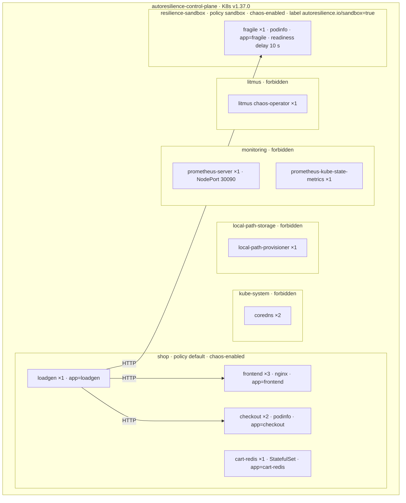

# Appendix · Kubernetes Topology

| | |
|---|---|
| **Purpose** | The exact topology of the evaluation cluster: nodes, namespaces, workloads, kinds, replicas, services, labels and selectors, and chaos objects. |
| **Source of truth** | `infra/kind/cluster.yaml`, `infra/sample-app/*.yaml`, `chaos/**`; live read-only `kubectl` inspection on 2026-10-07. |
| **Last generated from commit** | `92e33dd` |
| **Dependencies on other files** | [../12-experimental-environment](../12-experimental-environment.md) |

---

## Diagram

## Workloads

| Namespace | Workload | Kind | Replicas | Selector | Service (ClusterIP) | Container ports | Scraped by Prometheus |
|---|---|---|---|---|---|---|---|
| shop | frontend | Deployment | 3 | `app=frontend` | `frontend:80 → 80` | 80 | no |
| shop | checkout | Deployment | 2 | `app=checkout` | `checkout:80 → 9898` | 9898 http, 9797 metrics | yes (`prometheus.io/port: 9797`) |
| shop | cart-redis | StatefulSet | 1 | `app=cart-redis` | `cart-redis:6379` | 6379 | no |
| shop | loadgen | Deployment | 1 | `app=loadgen` | — | 9100 metrics | yes (`prometheus.io/port: 9100`) |
| resilience-sandbox | fragile | Deployment | 1 | `app=fragile` | `fragile:80 → 9898` | 9898, 9797 | yes |
| monitoring | prometheus-server | Deployment | 1 | chart labels | NodePort 80 → 30090 | — | self |
| monitoring | prometheus-kube-state-metrics | Deployment | 1 | chart labels | ClusterIP 8080 | — | yes |
| litmus | litmus | Deployment | 1 | chart labels | — | — | no |
| kube-system | coredns | Deployment | 2 | `k8s-app=kube-dns` | kube-dns | — | — |
| local-path-storage | local-path-provisioner | Deployment | 1 | `app=local-path-provisioner` | — | — | — |

## Chaos objects

| Object | Namespaces | Notes |
|---|---|---|
| ChaosExperiment `pod-delete` | shop, resilience-sandbox | go-runner 3.31.0; no probes |
| ServiceAccount + Role + RoleBinding `autoresilience-chaos` | shop, resilience-sandbox | namespace-scoped ([../06-safety-framework](../06-safety-framework.md) §6) |
| ChaosEngine `ar-<experiment id>` | created per experiment | labels `app.kubernetes.io/managed-by=autoresilience`, `autoresilience.io/experiment-id`, `autoresilience.io/pod-delete-mode` |
| ChaosResult `ar-<id>-pod-delete` | created by Litmus | deleted by owned cleanup |
| Orphans at audit time | resilience-sandbox | 6 ChaosEngines + 6 ChaosResults from development runs (their DB records were lost) |

## Pod naming used by AutoResilience queries

| Kind | Regex (`baseline.pod_name_regex`) |
|---|---|
| Deployment | `<name>-[a-z0-9]+-[a-z0-9]{5}` |
| StatefulSet | `<name>-[0-9]+` |

---

## Related documents
[../12-experimental-environment](../12-experimental-environment.md) · [../06-safety-framework](../06-safety-framework.md) · [environment-versions](environment-versions.md)

## Missing information
- Pod image digests (record them at campaign time).

## Open questions
- None.
